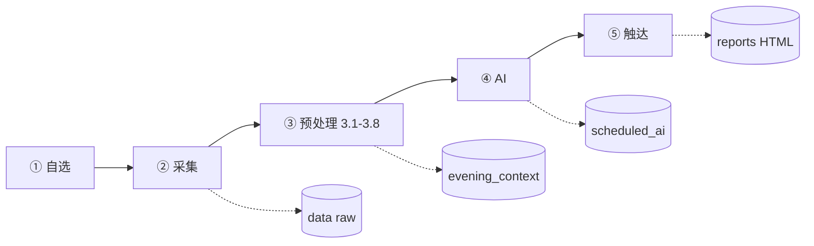

# 22 点晚间报告 · 开发文档（合并版）

> **主入口**：本文件为开发总览；各步详文见 §十二附录。  
> 状态：**规格定稿** · `packages/evening/` 与编排 CLI **待实现**  
> 对照（只读）：`D:\ZXReport` · 更新：2026-06-10

## 产品一句话

交易日 22:00「明日作战卡」：大盘环境 + 主线 + 自选 **31 只同级**研判 → HTML 详报、微信简报、明日预期 JSON。**集合竞价不参与。**

---

## 一、架构



### 硬规则

| 维度 | 规则 |
|------|------|
| 分析 | **按 code**（31 只各 1 次，不可跳过） |
| 展示 | **按 group**（35 行；我的 > 想买的 > 观察 > 其它） |
| LLM | 仅 **③ 3.6 / 3.8** + **④ 单次合成** |
| 增量 reuse | **仅公告+资讯**指纹；其余每日刷新 |
| 长文 | 全文进 digest，本地不截断 `content` |

---

## 二、五步流水线（对齐表）

| 步 | 名称 | LLM | 规划 CLI | 主产出 | 详文 |
|----|------|-----|----------|--------|------|
| **①** | 自选世界 | 否 | `quote query --all` | `quote_query_{date}.json` | [step1](evening-step1-watchlist.md) |
| **②** | 事实采集 | 否 | `collect --slot evening` | 7 路 raw + `collect_manifest` | [step2](evening-step2-collect.md) |
| **③** | 本地预处理 | 3.6/3.8 | `preprocess --slot evening` | `evening_context/{date}.json` | [step3](evening-step3-preprocess.md) |
| **④** | AI 研判 | 是×1 | `generate --phase ai` | `scheduled_ai` + `expectations` | [step4](evening-step4-ai.md) |
| **⑤** | 触达 | 否 | `generate --phase render` | `daily_evening.html` + 微信 | [step5](evening-step5-render.md) |

```bash
python run.py collect --slot evening      # ②（待实现；② 含 ① quote）
python run.py preprocess --slot evening   # ③（前重采 cls --articles）
python run.py generate --slot evening     # ④ → ⑤
```

运维全文：[`evening-runbook.md`](evening-runbook.md)

---

## 三、分步契约（开发对齐）

### ① 自选世界

| 项 | 约定 |
|----|------|
| **输入** | `ths.account_dir` + `ths.analyze_blocks.by_name` |
| **输出** | `quote_query`：31 `code_count` / 35 `row_count` / `memberships` / `structure` |
| **镜头** | 板块名 → `primary_stance`（见 [config §四](evening-config.md)） |
| **验收** | `schema_version: 2`；双板块股 `groups` 长度 = 2 |

### ② 事实采集（7 模块，无竞价）

| 序 | 模块 | 落盘 | 失败 |
|----|------|------|------|
| 1 | quote `--all` | `quote_query_{date}.json` | **阻断** |
| 2 | announcement 全 code | `announcement_query_{date}.json` | warn |
| 3 | news 全 code | `news_query_{date}.json` | warn |
| 4 | ecosystem | `market_sentiment/{date}.json` | warn |
| 5 | index `--slot evening` | `market_index/{date}.json` | warn |
| 6 | flow `--slot evening` | `market_flow/{date}.json` | warn |
| 7 | cls + `--articles` | `cls_finance/`、`cls_articles/` | warn（4/5 可继续） |

`collect_manifest/{date}.json`：各源 `ok|warn|fail` → ③ 3.2 `trust_flags`。

**边界**：② 不含 preprocess 前 cls 重采（归 ③ 3.8）。

### ③ 本地预处理（3.1 → 3.8）

| 子步 | 职责 | LLM |
|------|------|-----|
| 3.1 | 合并对齐 `EveningBundle` | 否 |
| 3.2 | 数据健康 `health` / `trust_flags` | 否 |
| 3.3 | 规则事件 `events_by_code` | 否 |
| 3.4 | 快照标签 + `primary_stance` | 否 |
| 3.5 | `market_local` L1/L2 本地 | 否 |
| 3.6 | 指纹 + `stock_{code}` feeds digest | 是 |
| 3.7 | `prompt` 骨架 + `local_block` | 否 |
| 3.8 | cls digest + **定稿落盘** | 是 |

**slim 产出**（第 4 步主读）：[`evening-schemas.md`](evening-schemas.md) · 样例 `samples/evening_context_*.json`  
**阅读**：step3 以 §3.1 起「审查优化后·定稿」为准，文首总览仅为摘要。

### ④ AI 研判

| 项 | 约定 |
|----|------|
| **输入** | `evening_context.prompt`（不重拼 7 路 raw） |
| **System** | [`evening-prompts.md`](evening-prompts.md) `EVENING_SYSTEM` + ZXTT 补丁 |
| **User 顺序** | priority → global → feeds_digest_bundle → events_block → cls → stocks |
| **输出** | `scheduled_ai/evening_{date}.json`、`expectations/{下一交易日}.json` |
| **推送摘要** | 含【观察】；label 用中文六档（大利空…轻多） |

### ⑤ 触达

| 项 | 约定 |
|----|------|
| **输入** | `evening_context` + `scheduled_ai`（只读）+ `quote_query`（35 行 join） |
| **原则** | 不调 LLM；微信**仅本步** |
| **产出** | `reports/{date}/daily_evening.html`、`last_report.json` |
| **UI** | MVP 三 Tab：[`evening-templates.md`](evening-templates.md) |

---

## 四、主数据路径

| 路径 | 写入步 | 读取步 |
|------|--------|--------|
| `data/quote_query_{date}.json` | ① | ②③⑤ |
| `data/collect_manifest/{date}.json` | ② | ③ |
| `data/evening_context/{date}.json` | ③ | ④⑤ |
| `data/evening_baseline/{date}.json` | ③ | ③ 次日 |
| `data/ai_digest/{date}/stock_{code}.json` | ③ | ④④D |
| `data/ai_digest/{date}/cls_{slot}.json` | ③ | ④④D |
| `data/ai_digest/{date}/manifest.json` | ③④ | ④⑤ |
| `data/scheduled_ai/evening_{date}.json` | ④ | ⑤ |
| `data/expectations/{target_date}.json` | ④ | ⑤ / 盘前 |
| `reports/{date}/daily_evening.html` | ⑤ | 人读 |

---

## 五、配置与 Prompt

| 文档 | 内容 |
|------|------|
| [`evening-config.md`](evening-config.md) | `evening.*`、`events.*`、`wechat.*`、`ths`、legacy `llm` |
| [`config.example.yaml`](../config.example.yaml) | 样例键值 |
| [`evening-prompts.md`](evening-prompts.md) | `EVENING_SYSTEM`、feeds/cls digest、verify |

---

## 六、实现落点（`packages/`）

| 模块 | 步骤 |
|------|------|
| `watchlist/` · `quote/query.py` | ① |
| `evening/collect.py` | ② 编排 |
| `evening/normalize.py` | 3.1 |
| `evening/health.py` | 3.2 |
| `events/`（cards + match） | 3.3 |
| `evening/tags.py` | 3.4 |
| `evening/market_local.py` | 3.5 |
| `evening/feeds_fingerprint.py` | 3.6 指纹 |
| `evening/feeds_digest.py` | 3.6 AI |
| `evening/local_block.py` | 3.7 |
| `evening/assemble.py` | 3.7 拼包 |
| `evening/cls_digest.py` | 3.8 |
| `evening/finalize.py` | 3.8 落盘 |
| `evening/prompt_build.py` | ④ user prompt |
| `ai/prompts.py` · `ai/llm.py` | ④ |
| `evening/generate.py` | ④ 编排 |
| `evening/expectations.py` | ④ 解析 |
| `evening/verify.py` | ④D 可选 |
| `report/render.py` · `report/push.py` | ⑤ |
| `evening/render.py` | ⑤ 编排 |
| `templates/daily_evening.html` | ⑤ |

老项目对照：[`evening-zxreport-map.md`](evening-zxreport-map.md)

---

## 七、验收清单（2026-06-10 基线）

**③** `evening_context`：`prompt.stocks`=31；`cls_digest.complete=false`（4/5）；`meta.context_as_of` 存在。  
**④** 正文 31 个 `###`；摘要含【观察】；`expectations` 键为 code。  
**⑤** HTML 35 行快照；`#stock-{code}` 可跳转；顶栏 31/35、cls 4/5。

---

## 八、附录 · 文档索引

| 文档 | 用途 |
|------|------|
| **本文 `evening-dev.md`** | 开发总览（合并入口） |
| [`evening-pipeline.md`](evening-pipeline.md) | 精简总览（指向本文） |
| [`evening-step1-watchlist.md`](evening-step1-watchlist.md) | ① 详文 |
| [`evening-step2-collect.md`](evening-step2-collect.md) | ② 详文 |
| [`evening-step3-preprocess.md`](evening-step3-preprocess.md) | ③ 3.1–3.8 全文 |
| [`evening-step4-ai.md`](evening-step4-ai.md) | ④ 详文 |
| [`evening-step5-render.md`](evening-step5-render.md) | ⑤ 详文 |
| [`evening-config.md`](evening-config.md) | 配置 |
| [`evening-schemas.md`](evening-schemas.md) + `samples/` | JSON 契约 |
| [`evening-prompts.md`](evening-prompts.md) | Prompt 全文 |
| [`evening-runbook.md`](evening-runbook.md) | 22 点运维 |
| [`evening-templates.md`](evening-templates.md) | 页面线框 |
| [`evening-zxreport-map.md`](evening-zxreport-map.md) | 老项目对照 |
| [`evening-doc-plan.md`](evening-doc-plan.md) | 文档补齐记录（已完成） |
| [`packaged-modules.md`](packaged-modules.md) §9 | 与八模块关系 |
