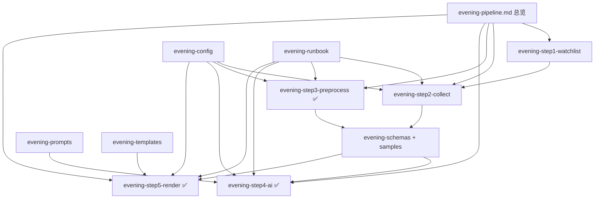

# 22 点晚间报告 · 文档补齐落地规划

> **已合并**：开发总览见 [`evening-dev.md`](evening-dev.md)（推荐入口）。本表为补齐过程记录。  
> 状态列：⬜ 未开始 · 🟡 进行中 · ✅ 已完成  
> 更新：2026-06-10

## 现状快照

| 已有 | 缺口 |
|------|------|
| `evening-pipeline.md` 总览 | ① 自选世界无专文 |
| `evening-step3/4/5-*.md` 定稿 | ② 采集编排无专文 |
| `packaged-modules.md` 八模块 CLI | `config.evening` 无集中说明 + 样例 |
| — | JSON 样例、Prompt 全文、运维 Runbook、页面线框 |

**目标**：补完后，新人/Agent 可仅凭文档实现 `collect → preprocess → generate` 全链，无需翻对话记录。

---

## 执行顺序（推荐）

```text
阶段 A（P0，先钉接口）  →  阶段 B（P1，AI/运维）  →  阶段 C（P2，体验/对照）
  ② 采集                    ① 自选                    页面线框
  config                    Prompt                    老项目对照（可选）
  JSON 样例                 Runbook
```

---

## 阶段 A · P0（开工整链前）

| 序 | 状态 | 产出文件 | 写什么 | 验收标准 |
|----|------|----------|--------|----------|
| A1 | ✅ | [`evening-step2-collect.md`](evening-step2-collect.md) | **第 2 步采集编排** | |
| | | | · `collect --slot evening` 与手动 7 命令等价关系 | |
| | | | · **执行顺序**（建议：quote → ann → news → ecosystem → index → flow → cls finance → cls articles） | |
| | | | · 每步：命令、入参、`data/` 落盘路径、失败是否阻断 | |
| | | | · `collect_manifest/{date}.json` 字段约定（各源 ok/warn/fail） | |
| | | | · 非交易日 `--force --date`；与 ① 前置（须先有 quote） | |
| | | | · **不含** preprocess 内 cls 重采（归 ③，在文中交叉引用） | ① 读完能写出 `run_collect_evening()` 伪代码；② 与 `packaged-modules.md` 八模块命令无矛盾 |
| A2 | ✅ | [`evening-config.md`](evening-config.md) + 改 [`config.example.yaml`](../config.example.yaml) | **晚间配置集中说明** | |
| | | | · `evening:` 块：`feeds_digest_workers`、`on_digest_fail`、`cls_digest_workers`、`cls_short_local_threshold`、`verify_enabled` | |
| | | | · `events:` / `config.evening.events` 与 3.3 词表关系 | |
| | | | · `wechat:` 与第 5 步推送开关 | |
| | | | · `ths.analyze_blocks` ↔ 板块名 ↔ `primary_stance` 映射表 | |
| | | | · LLM：继承 `legacy.zxreport_config` 哪些键 | `config.example.yaml` 有完整 `evening:` 注释块；`evening-config.md` 每个键有默认值 + 业务含义 |
| A3 | ✅ | [`evening-schemas.md`](evening-schemas.md) + [`samples/`](samples/) | **JSON 契约 + 样例** | |
| | | | · 主文档描述各文件顶层键；样例放 `docs/samples/` | |
| | | | · `evening_context_{date}.json`（slim，可截断 feeds 全文） | |
| | | | · `scheduled_ai/evening_{date}.json` | |
| | | | · `expectations_{date}.json`（`stocks[code]`） | |
| | | | · `evening_baseline_{date}.json` | |
| | | | · `ai_digest/manifest.json`（feeds + cls 段） | |
| | | | · 样例基准日：**2026-06-10**（与现有 `data/` 对齐） | 样例 JSON 可被 step3/4/5 文档中的字段名逐条对照；无「文档有、样例无」的顶层键 |

### 阶段 A 完成定义

- [x] A1–A3 均为 ✅  
- [x] `evening-pipeline.md` 第 2 步节增加 → `evening-step2-collect.md` 链接  
- [x] `README.md` 晚间段增加 config / schemas 链接  

---

## 阶段 B · P1（做第 4 步 & 22 点运维前）

| 序 | 状态 | 产出文件 | 写什么 | 验收标准 |
|----|------|----------|--------|----------|
| B1 | ✅ | [`evening-step1-watchlist.md`](evening-step1-watchlist.md) | **第 1 步自选世界** | |
| | | | · 同花顺路径、`analyze_blocks` 板块列表 | |
| | | | · `quote query --all` 产出：`quotes` / `memberships` / `structure` | |
| | | | · **31 code vs 35 row**；双板块同股（如 600021） | |
| | | | · orphan（如 600519）在 ③ 如何处理 | |
| | | | · 与 ② 关系：② 必须先有当日 `quote_query` | 能回答「我的/想买的/观察/其它」从哪来、会不会丢股 |
| B2 | ✅ | [`evening-prompts.md`](evening-prompts.md) | **Prompt 全文落盘** | |
| | | | · 从 `D:\ZXReport\src\llm.py` 迁 `EVENING_SYSTEM` + **ZXTT 补丁**（对齐 step4 定稿） | |
| | | | · feeds digest system + 输出 JSON 形状 | |
| | | | · cls B 层 digest system + 五栏顺序 | |
| | | | · 与 `evening-step4-ai.md` 交叉引用，避免双份矛盾 | 实现 `packages/ai/prompts.py` 时可复制粘贴，无需再读老项目 |
| B3 | ✅ | [`evening-runbook.md`](evening-runbook.md) | **22 点运维清单** | |
| | | | · 交易日时间线（17:00 盘后采 / 20:00 后 cls / 22:00 全链） | |
| | | | · 一键命令序列（含 preprocess 前 **重采 cls --articles**） | |
| | | | · 每步前置检查（文件是否存在、code_count=31） | |
| | | | · 失败降级：flow 失败、cls 4/5 仍出报告 | |
| | | | · 重跑规则：同日重跑 preprocess 是否覆盖 baseline | PM 不看代码也能按表操作一遍（或交给 Agent 执行） |

### 阶段 B 完成定义

- [x] B1–B3 均为 ✅  
- [x] `evening-pipeline.md` 五步表每步都有「详见 xxx.md」链接  

---

## 阶段 C · P2（联调 & 体验）

| 序 | 状态 | 产出文件 | 写什么 | 验收标准 |
|----|------|----------|--------|----------|
| C1 | ✅ | [`evening-templates.md`](evening-templates.md) | **HTML 页面线框**（MVP 三 Tab） | |
| | | | · 顶栏：日期、31/35、cls 4/5、health 摘要 | |
| | | | · Tab：研判 / 行情快照（35 行）/ 素材（slim） | |
| | | | · `#stock-{code}` 锚点、事件 badge（3.3 label） | |
| | | | · 无 AI 时的降级页 | 前端/模板实现者无需猜布局 |
| C2 | ✅ | [`evening-zxreport-map.md`](evening-zxreport-map.md)（可选） | 老项目文件 → ZXTT 步骤/模块对照 | 迁 `events.py`、`report_render.py` 时能一张表定位 |

### 阶段 C 完成定义

- [x] C1 为 ✅（C2 可选）  
- [x] C2 对照表已落盘

---

## 每步落盘时的统一动作

完成任一文档后，顺手做（≤5 分钟）：

1. 在本文 **状态列** 改为 ✅  
2. 在 [`evening-pipeline.md`](evening-pipeline.md) 对应步增加链接（若尚未有）  
3. 在 [`README.md`](../README.md)「晚间报告」段补链接（仅首次出现该类型文档时）  
4. 若新增 `config` 键：同步 `config.example.yaml` + `evening-config.md`  

---

## 建议节奏（给 PM）

| 周次 | 任务 | 产出 |
|------|------|------|
| 第 1 批 | A1 + A2 | 能定 CLI 编排与配置 |
| 第 2 批 | A3 | 能对照 JSON 写 ③ |
| 第 3 批 | B1 + B2 | 能写 ④ prompts |
| 第 4 批 | B3 | 能跑通 22 点清单 |
| 有空 | C1、C2 | 页面与老项目对照 |

每批完成后，可切 **Agent 模式** 说「按计划做 Ax」，由 Agent 落盘并勾 ✅。

---

## 文档依赖关系



---

## 全部完成后的文档树（目标态）

```text
docs/
├── evening-dev.md               ✅ 开发主文档（合并入口）
├── evening-pipeline.md          ✅ 精简总览
├── evening-doc-plan.md          ✅ 本表
├── evening-step1-watchlist.md   ✅
├── evening-step2-collect.md     ✅
├── evening-step3-preprocess.md  ✅
├── evening-step4-ai.md          ✅
├── evening-step5-render.md      ✅
├── evening-config.md            ✅
├── evening-schemas.md           ✅
├── evening-prompts.md           ✅
├── evening-runbook.md           ✅
├── evening-templates.md         ✅
├── evening-zxreport-map.md      ✅
└── samples/
    ├── evening_context_2026-06-10.json
    ├── scheduled_ai_evening_2026-06-10.json
    ├── expectations_2026-06-11.json
    ├── evening_baseline_2026-06-10.json
    └── ai_digest_manifest_2026-06-10.json
```

---

## 快速入口

| 从哪开始 | 打开 |
|----------|------|
| 开发主文档 | [`evening-dev.md`](evening-dev.md) |
| 精简总览 | [`evening-pipeline.md`](evening-pipeline.md) |
| 本计划 | 本文（已完成） |
| 下一步 | **实现** `packages/evening/`（见 `evening-dev.md` §六） |
