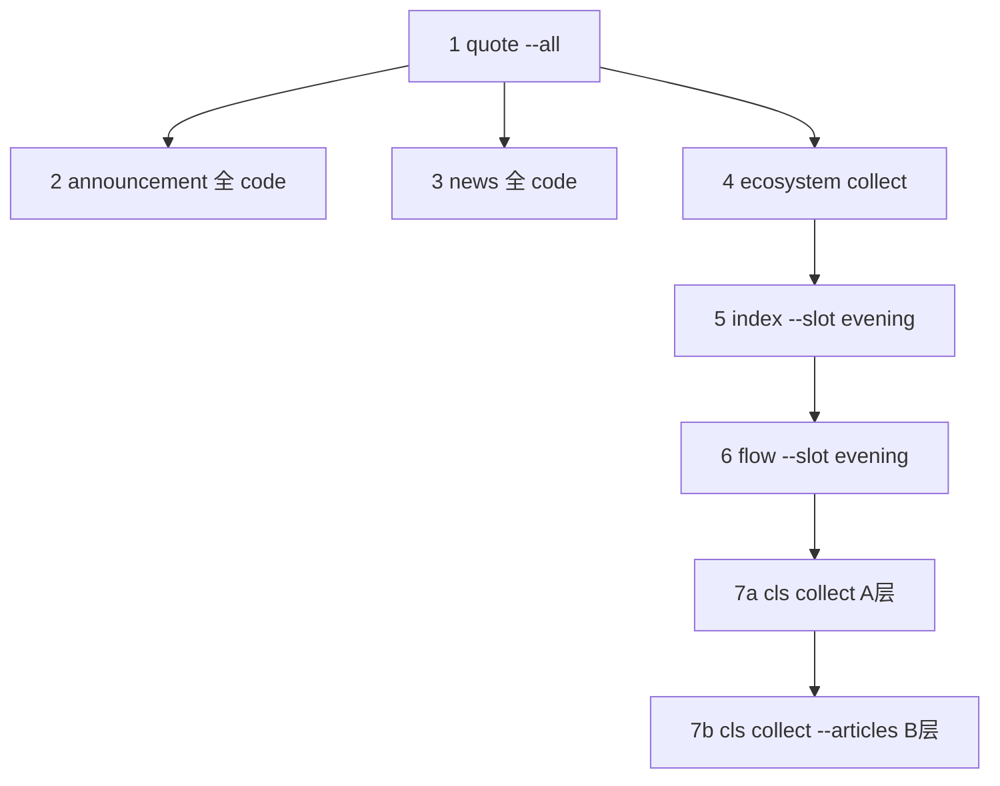

# 第 2 步 · 事实采集（7 模块 · 定稿）

> 步骤：**② / 5** · 开发总览：[`evening-dev.md`](evening-dev.md)  
> 位置：① 自选世界 → **第 2 步** → 第 3 步预处理  
> 状态：**规格定稿**；`collect --slot evening` **待实现**（见下文手动等价）  
> 前置：[`evening-step1-watchlist.md`](evening-step1-watchlist.md) 或当日 `quote_query`  
> 后续：[`evening-step3-preprocess.md`](evening-step3-preprocess.md)  
> 模块细节：[`packaged-modules.md`](packaged-modules.md)  
> 更新：2026-06-10

## 一句话

从外部拉 **7 路事实**（无竞价）落盘到 `data/`，供第 3 步合并；**分析按 code（31）**，板块归属来自当日 `quote_query`。

---

## 一、与规划 CLI 的关系

| 方式 | 命令 | 状态 |
|------|------|------|
| **目标** | `python run.py collect --slot evening` | 待实现 |
| **当前等价** | 下文「手动顺序」7+2 条命令 | 可用 |

实现 `collect --slot evening` 时应：

1. 解析 `--date` / `--force`（非交易日）
2. 若无当日 `quote_query` → 先跑 `quote query --all`
3. 从 `quote_query.quotes[].code` 取 **31 个去重 code** → 拼 `--codes` 给公告/资讯
4. 按 §三顺序执行各子命令
5. 结束时写 `data/collect_manifest/{date}.json`（§五）

**不含**：`preprocess` 前的 **cls 重采**（归第 3 步 3.8 编排，见 [`evening-step3-preprocess.md`](evening-step3-preprocess.md) §3.8）。

---

## 二、7 模块清单（22 点用）

| # | 模块 | 22 点 | 竞价 |
|---|------|-------|------|
| 1 | 行情 `quote` | ✅ | — |
| 2 | 公告 `announcement` | ✅ | — |
| 3 | 资讯 `news` | ✅ | — |
| 4 | 短线生态 `ecosystem` | ✅ | — |
| 5 | 指数 `index` | ✅ | — |
| 6 | 资金流 `flow` | ✅ | — |
| 7 | 财联社 `cls` | ✅ | — |
| — | 集合竞价 `auction` | ❌ | 仅 9:15–9:25 |

---

## 三、推荐执行顺序



**顺序理由**

| 步 | 说明 |
|----|------|
| quote 最先 | 白名单、31 code、`memberships`；公告/资讯/flow 自选主力都依赖 code 列表 |
| ann + news 可并行 | 互不依赖；实现编排时可 `ThreadPoolExecutor` |
| ecosystem → index → flow | 大盘块无硬依赖，顺序固定便于 manifest 与日志 |
| cls 分两次 | 默认 `cls collect` 采 A 层；`--articles` 采 B 层五篇长文 |

---

## 四、手动命令（当前可用）

**变量**：`DATE` 默认今天；非交易日加 `--force --date YYYY-MM-DD`。  
**全自选 code**：从 `data/quote_query_{DATE}.json` 的 `quotes[].code` 逗号拼接，或先跑 `quote --all`。

```bash
# 0. 前置：全自选行情（①+② 的起点）
python run.py quote query --all --date 2026-06-10

# 1. 公告（31 code，示例用 … 表示，实际为全部 code 逗号分隔）
python run.py announcement query --codes 600021,000021,... --date 2026-06-10

# 2. 资讯（含观点/研报/行业，默认 strict）
python run.py news query --codes 600021,000021,... --date 2026-06-10

# 3. 短线生态三池
python run.py ecosystem collect --date 2026-06-10

# 4. 指数（盘后槽位）
python run.py index collect --slot evening --date 2026-06-10

# 5. 资金流（含自选主力；默认 watchlist 开启）
python run.py flow collect --slot evening --date 2026-06-10

# 6. 财联社 A 层
python run.py cls collect --date 2026-06-10

# 7. 财联社 B 层五篇（22 点第一次采集；preprocess 前可能再采一次）
python run.py cls collect --articles --date 2026-06-10
```

**非交易日**：上述带 `collect` 的命令加 `--force`（`quote`/`announcement`/`news` 用 `--date` 即可）。

---

## 五、落盘路径与单步约定

| 模块 | 命令要点 | 落盘路径 | 失败策略（编排） |
|------|----------|----------|------------------|
| 行情 | `--all` | `data/quote_query_{date}.json` | **阻断**：无 quote 不继续 ann/news/flow 自选 |
| 公告 | 全 code `--codes` | `data/announcement_query_{date}.json` | **warn**：可继续；③ 标 `ANN_EMPTY` |
| 资讯 | 全 code | `data/news_query_{date}.json` | **warn** |
| 生态 | `ecosystem collect` | `data/market_sentiment/{date}.json` | **warn** |
| 指数 | `--slot evening` | `data/market_index/{date}.json` | **warn** |
| 资金流 | `--slot evening` | `data/market_flow/{date}.json` | **warn**（大盘主力失败常见，自选主力仍可用） |
| cls A | `cls collect` | `data/cls_finance/{date}.json` | **warn** |
| cls B | `cls collect --articles` | `data/cls_articles/{date}.json` | **warn**（4/5 仍进 ③） |

**`collect_manifest`（实现后写入）**

路径：`data/collect_manifest/{calendar_date}.json`

```json
{
  "schema_version": 1,
  "slot": "evening",
  "trade_date": "2026-06-10",
  "calendar_date": "2026-06-10",
  "collected_at_iso": "2026-06-10T22:05:00+08:00",
  "code_count": 31,
  "row_count": 35,
  "overall": "warn",
  "sources": {
    "quote_query": {
      "status": "ok",
      "path": "data/quote_query_2026-06-10.json",
      "code_count": 31,
      "row_count": 35
    },
    "announcement_query": {
      "status": "ok",
      "path": "data/announcement_query_2026-06-10.json",
      "item_count": 32
    },
    "news_query": {
      "status": "ok",
      "path": "data/news_query_2026-06-10.json",
      "item_count": 32
    },
    "market_sentiment": {
      "status": "ok",
      "path": "data/market_sentiment/2026-06-10.json"
    },
    "market_index": {
      "status": "ok",
      "path": "data/market_index/2026-06-10.json",
      "latest_slot": "evening"
    },
    "market_flow": {
      "status": "warn",
      "path": "data/market_flow/2026-06-10.json",
      "message": "market_main_net_failed"
    },
    "cls_finance": {
      "status": "ok",
      "path": "data/cls_finance/2026-06-10.json"
    },
    "cls_articles": {
      "status": "warn",
      "path": "data/cls_articles/2026-06-10.json",
      "articles_found": 4,
      "articles_expected": 5,
      "missing_slots": ["data_watch"]
    }
  },
  "warnings": ["FLOW_L1_FAIL", "CLS_INCOMPLETE_4_5"]
}
```

| `sources.*.status` | 含义 |
|--------------------|------|
| `ok` | 文件存在且 outcome 成功 |
| `warn` | 有文件但缺块/部分失败（③ 可降级） |
| `fail` | 未产出或 outcome=error |
| `skip` | 配置关闭（如 `cls_disabled`） |

| `overall` | 规则 |
|-----------|------|
| `ok` | 无 fail；quote 必 ok |
| `warn` | quote ok，任一路 warn |
| `fail` | quote fail，或编排中止 |

③ **3.2 数据健康** 读 manifest + 各 JSON `warnings` 填 `trust_flags`（见 step3 §3.2）。

---

## 六、与第 1 步 / 第 3 步边界

| 边界 | 约定 |
|------|------|
| ① → ② | ② 的 code 列表来自 `ths.analyze_blocks` → `quote --all`；无 `--all` 则不算完成 ② |
| ② → ③ | ③ 读 §五全部路径；**不在 ② 写** `evening_context` |
| ② vs ③ cls | ② 可采一次 `--articles`；**22:00 preprocess 前** ③ 要求再采（`data_watch` 常 20:00 后出） |
| 竞价 | 22 点链路**不调用** `auction` |

---

## 七、伪代码（`run_collect_evening`）

```text
def run_collect_evening(date, force=False):
    if not trading_day(date) and not force:
        return fail("not_trading_day")

    manifest = new_manifest(date, slot="evening")

    # 1 quote
    if not exists(quote_query(date)):
        r = run("quote query --all", date=date)
    else:
        r = load_existing_quote(date)
    manifest.sources.quote_query = status_from(r)
    if manifest.sources.quote_query.status == "fail":
        manifest.overall = "fail"
        write_manifest(manifest)
        return manifest

    codes = unique_codes_from_quote(date)  # 31

    # 2–3 feeds（可并行）
    manifest.sources.announcement_query = run_ann(codes, date)
    manifest.sources.news_query = run_news(codes, date)

    # 4–6 market
    manifest.sources.market_sentiment = run_ecosystem(date, force)
    manifest.sources.market_index = run_index(date, slot="evening", force)
    manifest.sources.market_flow = run_flow(date, slot="evening", force)

    # 7 cls
    manifest.sources.cls_finance = run_cls(date, force)
    manifest.sources.cls_articles = run_cls_articles(date, force)

    manifest.overall = aggregate(manifest.sources)  # quote fail→fail else any warn→warn
    manifest.collected_at_iso = now()
    write_manifest(manifest)
    return manifest
```

---

## 八、验收（2026-06-10 基线）

| 检查 | 预期 |
|------|------|
| `quote_query` | `code_count=31`, `row_count=35`, `schema_version=2` |
| `announcement_query` | `items` 与 31/32 code 对齐 |
| `news_query` | 同上 |
| `market_sentiment` | 含三池、pool 分 |
| `market_index` | `indices` 4 项 |
| `market_flow` | `watchlist_flow` 31 条；大盘 `main_net` 可为 null |
| `cls_finance` | A 层字段齐 |
| `cls_articles` | 4/5 可接受，缺 `data_watch` |
| manifest（实现后） | `overall=warn` 与上表一致 |

---

## 九、实现落点（规划）

| 模块 | 职责 |
|------|------|
| `packages/evening/collect.py` | `run_collect_evening()` |
| `run.py` | `collect --slot evening` 子命令 |
| 复用 | 各模块现有 `cmd_*` 逻辑，不重复实现采集 |

---

## 十、定稿勾选

- [x] 7 模块无竞价  
- [x] 手动命令与 `packaged-modules.md` 一致  
- [x] quote 前置 + 全 code 公告资讯  
- [x] `collect_manifest` 字段约定  
- [x] cls 重采归 ③，不写进 ② 编排  
- [x] 失败 warn/阻断策略  

**第 2 步采集规格已定稿。**
