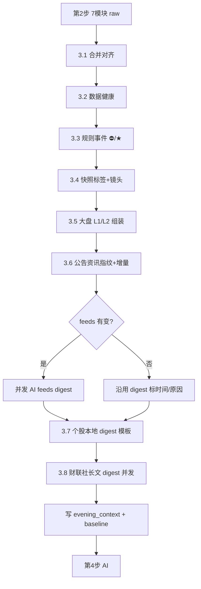
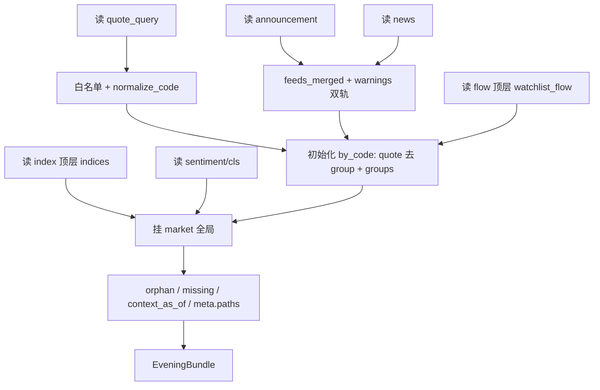
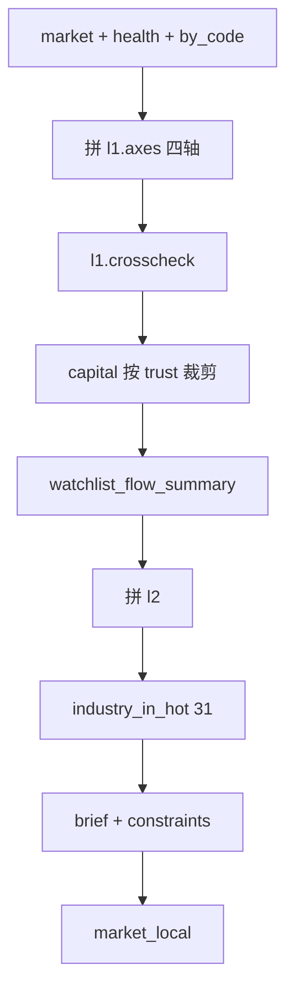
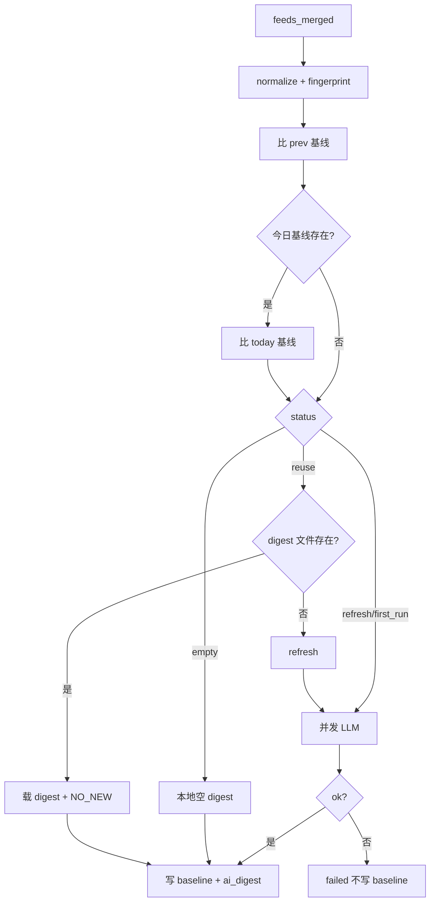
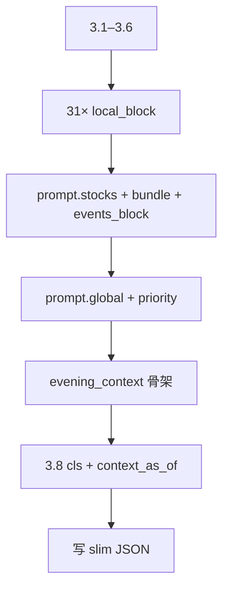
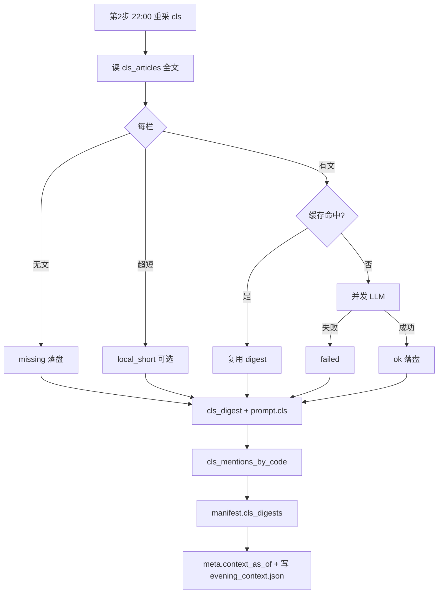

# 第 3 步 · 本地预处理（3.1–3.8 · 定稿）

> 步骤：**③ / 5** · 开发总览：[`evening-dev.md`](evening-dev.md)  
> 位置：第 2 步采完 → **第 3 步** → 第 4 步 AI 研判  
> 状态：**规格定稿**；`preprocess --slot evening` **待实现**  
> 前置：[`evening-step2-collect.md`](evening-step2-collect.md) · 后续：[`evening-step4-ai.md`](evening-step4-ai.md)  
> 契约：[`evening-schemas.md`](evening-schemas.md) · 对照：`D:\ZXReport\src\events.py`  
> 更新：2026-06-10

> **阅读说明**：下文「## 总览」为早期梳理摘要，字段名可能与定稿不一致。**实现与对接第 4/5 步时，以各节「审查优化后 · 定稿」（§3.1 起）及 [`evening-schemas.md`](evening-schemas.md) 的 slim `evening_context` 为准。**

## 总览

**位置**：第 2 步采完 → **第 3 步** → 第 4 步 AI 研判  

**一句话**：把 7 路 raw JSON 收成一份 `evening_context`——**本地算清的本地算，长文不截断走并发 digest，只有公告+资讯和昨天比、无变则沿用旧 digest。**

---

### 总流程



---

### 硬规则（已定）

| 规则 | 内容 |
|------|------|
| 分析单元 | **按 code**，31 只各一份，不重复 |
| 排版 | **按 group**，35 行归属；同股多板块共用分析 |
| 镜头 MVP | `我的` / `想买的` / `跌幅达到预期重点关注` 三档固定；其余 → **其它** |
| 主镜头 | 我的 > 想买的 > 观察 > 其它 |
| 每日必新 | 行情、三池、指数、flow、cls A 层、本地 tags、L1/L2、规则重扫 |
| **仅增量** | **公告 + 资讯**（含观点/研报/行业资讯）指纹对比昨日 |
| 长文 | **不截断**；全文进 **并发 AI digest**，digest 写入上下文 |
| 22 点综合 AI | **每天 fresh**；feeds digest 可 reuse |

---

### 分步说明

#### 3.1 合并对齐

- 骨架：`quote_query`（31 code + memberships + structure.groups）
- 按 code 合并：`announcement_query` + `news_query` → `feeds_merged`
- 按 code 挂：`market_flow.watchlist_flow`
- 全局挂：`market_sentiment`、`market_index`、`cls_finance`、`cls_articles`（**全文保留**）
- 白名单外 code（如 600519）→ 丢弃，记 health
- 算 `context_as_of` 草稿（各源最晚时间；定稿时刻见 3.8）

#### 3.2 数据健康

- **全局**：flow 大盘/行业失败、财联社 4/5、北向可疑等 → `trust_flags`
- **按 code**：公告空、资讯 stale、名称异常、双源 warning
- 三级：`block` / `warn` / `info`；**不删数据，只贴标**

#### 3.3 规则事件 ⛔/★

- 扫 feeds 标题；资讯过 `news_matches_stock`
- 关键词分级；无公告印证 → **待核实**
- 行业事件扩散；输出 **`events_by_code`**
- **每天重扫**（feeds 无变结果通常不变）

#### 3.4 快照标签 + 镜头

- 从 quote 派生：涨跌档、均线、形态、量能、池子等
- 挂 `flow.main_net_yi`
- 算 `primary_stance`、`groups[]`
- **每天重算**

#### 3.5 大盘 L1/L2 组装

- **不重算情绪分**，裁剪 `market_sentiment` + `index` + `cls_finance`
- L2 与自选 **行业交集**（本地）
- 财联社长文此处只进 **索引**；正文留给 3.8 digest
- **每天 fresh**

#### 3.6 公告 + 资讯指纹（唯一增量层）

```text
fingerprint[code] = hash(公告条目 + 资讯/观点/研报/行业条目)
对比：昨日 baseline（或上一交易日）
```

| 结果 | 动作 |
|------|------|
| 相同 | `feeds_digest.status=reuse`，沿用缓存 + `analyzed_at` + `NO_NEW_ANNOUNCEMENT_OR_NEWS` |
| 不同 | 排队 **并发 AI feeds digest**（全文，不截断） |
| 首日 | 全量 digest |

#### 3.7 个股本地 digest（模板）

- 每只 code 一段：快照 + 资金 + tags + events 摘要 + health + feeds digest（fresh/reuse 状态）
- **每天重写**（行情天天变）
- 与 AI feeds digest 分开：模板必新，资讯 AI 可 reuse

#### 3.8 财联社长文 digest（并发）

- 每篇全文 → 1 个 AI 任务；缺篇只 health 标黄
- 按篇比昨日（`published_at`/hash），无新稿可 reuse 该篇 digest
- digest 落盘，原文不删

---

### 产出物（摘要 · 定稿见 §3.7/3.8 与 schemas）

**主文件（slim）**：`data/evening_context/{date}.json` — 结构见 [`evening-schemas.md`](evening-schemas.md)。

```text
meta, group_order, memberships, structure
health, market_local, events_by_code, industry_in_hot_by_code
by_code[code].local_block + feeds_digest_ref
feeds_digest_by_code, prompt（3.7 骨架 + 3.8 补 cls）
cls_digest, cls_mentions_by_code
meta.context_as_of   # 仅 3.8 定稿写入（含 digest 时刻）
```

**审计包（可选）**：`evening_bundle_full.json` — 含 3.1 全量 `feeds_merged`；第 4 步不读。

**基线**：`data/evening_baseline/{date}.json` — 3.6 指纹，供次日对比。

**digest 单篇**：`data/ai_digest/{date}/stock_{code}.json`、`cls_{slot_key}.json`；manifest 合并登记。

---

### 与第 4、5 步边界

| 第 3 步 | 第 4 步 |
|---------|---------|
| 事实、标签、规则事件、digest | 消息 net、守减观望、明日预期、推送摘要 |
| reuse 原因说明 | 结合**今日新行情**写作战卡 |
| 不截断原文 | 主要读 digest bundle，全文备查 |

第 5 步 HTML：按 **group** 排版；展示 `feeds_digest.reuse_reason_cn`。

---

### 你今天数据（2026-06-10）会怎么走

- 31/35 合并；flow 大盘主力失败 → trust 降级，用自选主力
- 21 只公告空、多股资讯 stale → 指纹可能连续多日相同 → **feeds digest 大量 reuse**
- 三博脑科、上海电力等减持 → 3.3 事件命中；feeds 无变则事件列表同昨日
- 京东方等 → 3.4 每天新 tags；3.7 模板每天新
- 财联社 4 篇 → 3.8 四路并发 digest
- 无昨日 baseline → 首日全量 feeds digest

---

### 实现入口（规划）

```bash
python run.py preprocess --slot evening
# 或合在 generate --slot evening 内：collect → preprocess → ai
```

模块方向：`packages/evening/`（normalize、health、tags、market_pack、build_context）+ `packages/events/` + `packages/digest/`（指纹、并发 AI、缓存）

---

以上为第 3 步定稿。要落地实现切 **Agent 模式**；若要改顺序（如 digest 在模板前/后）再说一声即可。

---

## 3.1 合并对齐（审查优化后 · 定稿）

**位置**：第 2 步采完 → **3.1** → 3.2 健康  
**频率**：每交易日必做  
**原则**：收成一张工作台；**分析按 code，展示按 group**；不删 raw、不调 AI、不打健康标签。

---

### 一、职责

| 做 | 不做 |
|----|------|
| 按 code 挂行情、feeds、自选主力 | 健康 / trust（→3.2） |
| 保留 memberships / structure / group_order | 事件 / tags（→3.3 / 3.4） |
| 挂全局大盘块（全文） | 指纹 / digest（→3.6 / 3.8） |
| 白名单过滤、orphan 隔离、算 context_as_of | 截断财联社长文 |

```text
7 路 raw JSON  →  EveningBundle（内存或 evening_context 前半）
                      ↓
                   3.2 health
```

---

### 二、输入文件

| 文件 | 角色 |
|------|------|
| `quote_query_{date}.json` | **主索引** |
| `announcement_query_{date}.json` | 公告 |
| `news_query_{date}.json` | 资讯 / 观点 / 研报 / 行业 |
| `market_sentiment/{date}.json` | 短线生态 |
| `market_index/{date}.json` | 指数 |
| `market_flow/{date}.json` | 资金流 + 自选主力 |
| `cls_finance/{date}.json` | 财联社 A 层 |
| `cls_articles/{date}.json` | 财联社 B 层全文 |
| `collect_manifest/{date}.json` | 仅记路径（3.2 解析） |

**不用**：`auction_*`（22 点盘后链路）。

---

### 三、主键与白名单

**白名单** = `quote_query.quotes[]` 全部 code（今天 31 只）。  
**全链路** `normalize_code`（`zfill(6)`）后再匹配。

| 情况 | 处理 |
|------|------|
| ann/news 有 code，不在白名单 | 不进 `by_code` → `meta.orphan_codes`（今天 `600519`） |
| 白名单 code，ann 或 news **缺行** | 仍建 `by_code`；对应类 `[]` → `meta.missing_feeds_sources[]` |
| 行情 | `quotes` 每 code **一条**；**删除行内 `group`** |
| 板块归属 | **只信** `memberships` + `structure` |

今天：`code_count=31`，`row_count=35`，4 板块；3 只双板块（`600021`、`300323`、`603773`）。

---

### 四、读取层规则（flow / index）

`market_flow`、`market_index` 有「snapshots 嵌套 + 顶层扁平」两套。

**默认**：读顶层扁平字段（`latest_slot == evening` 时与当日盘后一致）：

- flow：`watchlist_flow`、`northbound`、`market`、`sectors_*`、`flow_score/signal/hint`、`warnings`
- index：`indices`

**回退**：`latest_slot != evening` 时，取 `snapshots[]` 中 `slot=evening` 的同名字段。

**禁止**同时读嵌套与顶层，避免重复或取旧槽。

---

### 五、`by_code[code]` 结构

```text
by_code[code] = {
  quote:          quotes 整行（无 group）
  groups:         来自 memberships 的全部板块名[]（顺序=memberships 出现顺序）
  feeds_merged:   见下节
  feeds_meta: {
    industry:     quote.industry 优先，news item 兜底
    ann_queried_at, news_queried_at
  }
  flow_stock: {
    main_net_yi, pct_chg          // 仅两字段，不带 group
  }
}
```

**group 三源禁用**：不用 quote / flow / feeds 行内 `group` 写归属；`primary_group` / stance 留给 **3.4**。

**flow_stock**：只从顶层 `watchlist_flow` 按 code 取一条（同 code 数值相同，取首条）。

---

### 六、`feeds_merged` 合并

#### 字段（与 `StockFeeds` 对齐）

```text
feeds_merged: {
  公告:       announcement.announcements[]
  资讯:       news.news[]
  观点:       news.opinions[]
  研报:       news.research[]
  行业资讯:   news.industry_news[]
  warnings:       string[]
  warnings_struct: { code_key, message, category, code, group }[]
}
```

#### 合并规则

| 来源 | 写入 |
|------|------|
| announcement | 五类之「公告」+ 单对象 `warning` → 同时进 `warnings[]` 与 `warnings_struct` |
| news | 四类 + `warnings[]` + `warnings_struct[]` append |
| 去重 | 同 code 内同 `code_key` **保留第一条** |

**同 code 只合并一次**（不随 35 行 memberships 重复）。

---

### 七、全局 `market`

```text
market: {
  sentiment:      market_sentiment 整文件
  index:          { indices, latest_slot, collected_at_iso, ... }  // 顶层扁平
  cls_finance:    cls_finance 整文件
  cls_articles:   cls_articles 整文件（content 全文保留）
  flow_meta: {
    latest_slot, watchlist_enabled,
    northbound, market,              // main_net_yi 可为 null，原样保留
    sectors_inflow_top, sectors_outflow_top,
    flow_score, flow_signal, flow_hint,
    file_warnings[]                  // 文件顶层 warnings 原文
  }
}
```

`watchlist_flow` **只在** `by_code[].flow_stock`，不进 `market` 重复 31 遍。

---

### 八、结构层（渲染用）

```text
group_order  ← structure.groups[].name 顺序（不重排）
memberships  ← quote_query.memberships
structure    ← quote_query.structure
```

今天顺序：**我的 → 想买的 → 高度关注 → 跌幅达到预期**。

`join_quotes_with_memberships` 仅 **3.7 / HTML 展示**（35 行）；分析链路只用 `by_code`。

---

### 九、`meta`

```json
{
  "schema_version": 1,
  "pipeline_step": "3.1",
  "trade_date": "2026-06-10",
  "calendar_date": "2026-06-10",
  "context_as_of": "2026-06-10 17:39:49",
  "code_count": 31,
  "row_count": 35,
  "orphan_codes": ["600519"],
  "missing_feeds_sources": [],
  "paths": {
    "quote": "data/quote_query_2026-06-10.json",
    "announcement": "data/announcement_query_2026-06-10.json",
    "news": "data/news_query_2026-06-10.json",
    "market_sentiment": "data/market_sentiment/2026-06-10.json",
    "market_index": "data/market_index/2026-06-10.json",
    "market_flow": "data/market_flow/2026-06-10.json",
    "cls_finance": "data/cls_finance/2026-06-10.json",
    "cls_articles": "data/cls_articles/2026-06-10.json",
    "collect_manifest": "data/collect_manifest/2026-06-10.json"
  }
}
```

**`context_as_of`（3.1 草稿）** = 各输入文件级时间戳的最大值，仅供 bundle 内参考。  
**定稿 `meta.context_as_of`** 由 **3.8** 写入 `evening_context.json`（含 digest 完成时刻，见 §3.8）。  
**`trade_date`** = `quote_query.calendar_date`。

---

### 十、处理流程



1. 读 `quote_query` → 白名单、`memberships`、`structure`  
2. 建 `by_code`：`quote`（去 group）、`groups[]`  
3. 合并 ann + news → `feeds_merged` + `feeds_meta`  
4. 合并 `watchlist_flow` → `flow_stock`（仅两字段）  
5. 挂 `market.*`（flow/index 读顶层扁平）  
6. 扫 orphan / missing；算 `context_as_of`  
7. 输出 `EveningBundle`

---

### 十一、实现落点

| 能力 | 位置 |
|------|------|
| 读 quote | `packages/quote/query_cache.load_quote_query_cache` |
| normalize | `packages/core/config.normalize_code` |
| join 展示行 | `packages/quote/query_cache.join_quotes_with_memberships`（3.7 用） |
| 新建 | `packages/evening/normalize.py` → `build_evening_bundle(trade_date)` |

建议输出：`data/evening_context/{date}.json` 在 **3.7 落盘**；3.1 可先内存传递。

---

### 十二、与其它步骤

| 步骤 | 依赖 3.1 |
|------|----------|
| 3.2 | `by_code`、`market`、`meta.paths.collect_manifest`、`warnings_struct` |
| 3.3 | `feeds_merged` 五类全量 |
| 3.4 | `quote`、`flow_stock`、`groups[]` |
| 3.5 | `market.sentiment` / `index` / `flow_meta` |
| 3.6 | `feeds_merged` + `feeds_meta` 算指纹 |
| 3.7 | `group_order`、`memberships`、`structure` |

---

### 十三、今天验收（2026-06-10）

| 项 | 预期 |
|----|------|
| `by_code` | 31 只齐；双板块 `groups` 长度 = 2 |
| orphan | 仅 `600519` |
| flow | 自选主力 31/31；大盘 `main_net_yi` null 进 `flow_meta` |
| index | 4 指数在 `market.index.indices` |
| cls | 4/5 长文 + warnings 原文保留 |
| feeds | 五类 + `ANN_EMPTY` 等进 `warnings_struct` |
| `context_as_of` | ≈ `17:39:49` |

---

### 十四、定稿勾选

- [x] quote 主索引；31 code 白名单；`normalize_code`  
- [x] ann+news → `feeds_merged`（五类中文 + warnings 双轨 + `feeds_meta`）  
- [x] flow/index 读顶层扁平；`flow_stock` 仅自选两字段  
- [x] `groups[]` 只来自 memberships；quote/flow/feeds 行内 group 禁用  
- [x] `market.*` 全局；长文不截断；`flow_meta` 细结构  
- [x] `group_order` / `memberships` / `structure` 原样不重排  
- [x] `orphan_codes`、`missing_feeds_sources`、`context_as_of`、`meta.paths`  
- [x] 不打 health；不 digest；不删 raw  

**3.1 已定稿。** 可继续 **3.5** 或切 Agent 模式实现 `build_evening_bundle`。

---

## 3.2 数据健康（审查优化后 · 定稿）

**位置**：3.1 合并 → **3.2** → 3.3 规则事件  
**频率**：每交易日必做  
**原则**：只贴可信度标签，**不删、不改**事实。

---

### 一、职责

汇总各源成败与空洞/过期/可疑值 → `health` + `trust_flags` + `health_brief`，供 3.3～第 4 步降权或提示。

```text
3.1 合并 → 3.2 健康标签 → 3.3 事件 …
```

---

### 二、健康分级

| 级别 | 含义 | 典型 |
|------|------|------|
| **block** | 该股难分析 | `QUOTE_MISSING`、`FEED_COLLECT_FAILED` |
| **warn** | 可分析须降权 | `NEWS_STALE`、`FEEDS_ALL_EMPTY`、flow 失败 |
| **info** | 提示 | `ANN_EMPTY`、某类资讯空 |

---

### 三、`trust_flags`（全局可信度）

由 `collect_manifest` + 大盘 JSON 映射（**固定表**）：

| manifest / 源 | 字段 |
|---------------|------|
| 生态三池等 | `ecosystem` |
| `cls_finance` / cls API | `cls_finance` |
| `cls_articles` 篇数 | `cls_articles_complete` |
| `tencent_index` | `index` |
| `akshare_market_flow` | `market_main_flow` |
| `akshare_sector_flow` | `sector_flow` |
| `akshare_hsgt` + 数值 | `northbound_suspicious` |
| `akshare_watchlist_flow` | `watchlist_flow` |

**北向 suspicious**：`net_yi==0` **且**（manifest 异常 / connect_status 异常）；否则仅 info。

**第 4 步硬约束**：

- `market_main_flow: false` → 禁止写大盘主力净流入/出  
- 可用：三池、指数、自选主力  
- `cls_articles_complete: false` → 可写 A 层，长文注明缺篇  

---

### 四、全局健康 `health.global[]`

| 检查 | `code_key` | 级别 |
|------|------------|------|
| 大盘主力失败 | `FLOW_MARKET_FAIL` | warn |
| 行业 TOP 失败 | `FLOW_SECTOR_FAIL` | warn |
| 财联社长文不齐 | `CLS_ARTICLES_INCOMPLETE` | warn |
| 北向可疑 | `NORTHBOUND_SUSPICIOUS` | warn |

- 同源消息 **按 code_key 去重**（不重复 6 条主力失败）  
- 财联社：**A 层**（`cls_finance`）与 **B 层**（五篇）分开标

---

### 五、按 code `health.by_code` + 展示降噪

**存储**：`by_code[code][]` 全量保留。

**展示**：`display_by_code[code][]` 规则：

| 纳入 display | 规则 |
|--------------|------|
| block / warn | 全部 |
| info 级 `ANN_EMPTY` 等 | 仅 **我的 / 想买的 / 观察池**；其余板块 info 不进 display |
| 汇总 | `summary` 统计全量（如 `ann_empty_codes: 21`） |

**个股 `code_key`（复用 `feed_warnings` + 扩展）**：

| 码 | 级别 |
|----|------|
| `ANN_EMPTY` | info |
| `ANN_LATEST_FALLBACK` | warn |
| `NEWS_STALE` | warn |
| `NEWS_EMPTY` / `RES_EMPTY` / `IND_EMPTY` | info |
| `FEED_COLLECT_FAILED` | block |
| `FEEDS_ALL_EMPTY` | warn（五类皆空） |
| `QUOTE_MISSING` | block |
| `QUOTE_VERIFY` | warn/info |
| `NAME_INCOMPLETE` | warn |

---

### 六、`health_brief`（给 AI 一句人话）

3.2 自动生成，例（2026-06-10）：

```text
大盘主力与行业资金不可用；北向存疑；财联社长文 4/5（缺数据看盘）；自选主力可用；21 只近3日无公告（常态）。
```

写入 `evening_context.health.health_brief`。

---

### 七、与 3.6 分工

| | 3.2 | 3.6 |
|--|-----|-----|
| 职责 | 质量、可信度 | 是否重跑 feeds digest |
| `NEWS_STALE` | warn，保留数据 | 指纹不变可 reuse |
| `ANN_EMPTY` | info | 常致指纹不变 |

---

### 八、输出结构

```json
{
  "health": {
    "health_brief": "…",
    "global": [
      { "code_key": "FLOW_MARKET_FAIL", "level": "warn", "message": "大盘主力采集失败" }
    ],
    "trust_flags": {
      "market_main_flow": false,
      "sector_flow": false,
      "northbound_suspicious": true,
      "cls_finance": true,
      "cls_articles_complete": false,
      "watchlist_flow": true,
      "ecosystem": true,
      "index": true
    },
    "by_code": { "600519": [ "..."] },
    "display_by_code": { "600010": [ "..."] },
    "summary": {
      "block_codes": 0,
      "warn_codes": 5,
      "ann_empty_codes": 21,
      "news_stale_codes": 8,
      "feeds_all_empty_codes": 0
    }
  }
}
```

---

### 九、处理流程

1. manifest → `trust_flags`（映射表）  
2. flow / cls 篇数 → `global`（去重）  
3. 遍历 31 code → 合并 ann/news/quote → `by_code`  
4. 五类皆空 → `FEEDS_ALL_EMPTY`  
5. 生成 `display_by_code`、`summary`、`health_brief`

---

### 十、与其它步骤

| 步骤 | 用法 |
|------|------|
| 3.3 | 不挡扫描；可读 stale/empty |
| 3.5 | L1 必读 `trust_flags` |
| 3.7 | 顶栏 `global` + `health_brief`；每股用 `display_by_code` |
| 第 4 步 | prompt 附 `health_brief` + `trust_flags` |

---

### 十一、配置

```yaml
health:
  cls_articles_expected: 5
  northbound_zero_warn: true
  ann_empty_level: info
  news_stale_level: warn
  display_info_stances: [holding, candidate, watch_right]
```

---

### 十二、定稿勾选

- [x] 三级 block/warn/info  
- [x] `trust_flags` + manifest 映射表  
- [x] global 去重；cls A/B 分离  
- [x] `by_code` 全量 + `display_by_code` 降噪  
- [x] `FEEDS_ALL_EMPTY`、`health_brief`  
- [x] 北向 suspicious 有条件判定  
- [x] 不删数据；stale 保留降权  

**3.2 审查优化后已定稿。** 可继续 **3.5**，或切 Agent 实现。

---

## 3.3 规则事件（审查优化后 · 定稿）

**位置**：3.1 合并 → 3.2 健康 → **3.3** → 3.4 标签  
**频率**：每交易日 **重扫**（与 3.6 资讯指纹 reuse **独立**）  
**单元**：按 **code**，31 份

---

### 一、职责

在全量 `feeds_merged` 上生成 **事件索引** `events_by_code`：不调 AI、不删原文、不替代 feeds digest。

```text
feeds_merged（全量） → feeds digest（AI，可 reuse）
        ↓
   events_by_code（规则，每天重扫）
```

---

### 二、事件标签

| 档位 | `tier` | `label` | 简报 | 展示优先级 |
|------|--------|---------|------|------------|
| 重大利空 | `critical_bear` | **大利空** | 大利空 | 10 |
| 重大利好 | `critical_bull` | **大利好** | 大利好 | 10 |
| 一般利空 | `high_bear` | **利空** | 利空 | 30 |
| 一般利好 | `high_bull` | **利好** | 利好 | 30 |
| 轻度利空 | `medium_bear` | **轻空** | 轻空 | 50 |
| 轻度利好 | `medium_bull` | **轻多** | 轻多 | 50 |
| 无 | — | **无** | · | — |

**待核实**（后缀，非第七档）：`大利空·待核实` / `大利好·待核实`  
**仅当**：`tier` 为 critical + 来源非公告 + lookback 内无同主题公告印证。

---

### 三、减持（写死）

| 来源 | 档位 | 待核实 |
|------|------|--------|
| 公告（减持计划/公告类） | **利空**；情节严重可 **大利空** | 否 |
| 仅资讯 | **利空** | **否** |

---

### 四、默认关键词

| 档位 | 关键词 |
|------|--------|
| 大利空 | 退市、*ST、ST（见 §五边界）、立案、调查、造假、预亏、暴雷、修正向下… |
| 大利好 | 业绩预增、扭亏、重大合同、重大中标、资产注入、大幅预增… |
| 利空 | 减持、质押、问询函、关注函、诉讼、预减、下滑… |
| 利好 | 回购、增持、获批、量产、订单大增… |
| 轻空 | 亏损、下滑、风险、警示 |
| 轻多 | 增长、突破、合作、签约 |

- 子串匹配；多档命中取 **最高档**（critical > high > medium）  
- 同档 **长词优先**  
- `config.events` 可覆盖；`enable_medium: true`（默认开）

```yaml
events:
  enable_medium: true
  display_max: 3          # 简报/3.7 每只最多展示条数
  lookback_days: 3        # 与公告采集一致，用于待核实/减持印证
```

---

### 五、匹配规则

| 类别 | 规则 |
|------|------|
| **公告** | 标题直接匹配 |
| **资讯 / 观点** | 先 `news_matches_stock`，再关键词 |
| **研报** | 标题直接匹配（不过滤股票名） |
| **行业资讯** | 匹配 tier；仅 **大利空/大利好** 进行业桶并扩散至同 `industry` 自选 |
| **ST** | 边界匹配：`*ST`、`ST` 前缀股名、退市语境；避免误伤普通子串 |

**去重**：同 code 内 `(title, pub_date, tier)` 相同只留一条。

**行业扩散**：仅 **大利空 / 大利好**；利空、利好、轻空、轻多 **不扩散**。

---

### 六、与 3.6 指纹联动

对每只 code 算公告+资讯指纹（同 3.6）：

| 指纹 | 事件行为 |
|------|----------|
| 较昨日 **有变** | 正常扫描；命中项 `is_new: true` |
| **无变** | 仍重扫；命中项 `is_new: false` |

3.7 / 简报可写：`利空 股东减持…（非今日新稿）`。

feeds digest 可 reuse；**3.3 仍每天出完整 `events_by_code`**。

---

### 七、输出结构

```json
{
  "code": "301293",
  "critical_bear": [],
  "critical_bull": [],
  "bear": [
    {
      "tier": "high_bear",
      "label": "利空",
      "direction": "bear",
      "title": "股东TBP拟减持…",
      "pub_date": "2026-06-10",
      "category": "资讯",
      "source_type": "舆情",
      "unverified": false,
      "is_new": true,
      "display_priority": 30
    }
  ],
  "bull": [],
  "summary": {
    "大利空": 0, "大利好": 0, "利空": 1, "利好": 0,
    "轻空": 0, "轻多": 0, "unverified": 0
  },
  "display": []
}
```

- **`display`**：按 `display_priority` 排序后取前 **`display_max`（默认 3）** 条，供 3.7 / 简报  
- 全量列表仍在 `critical_*` / `bear` / `bull`，供第 4 步 AI  
- **无命中**：`我的` / `想买的` 在 3.7/第 4 步仍写 **「无规则命中」**

---

### 八、与其它步骤

| 步骤 | 关系 |
|------|------|
| 3.4 | 行情 tags；与 events **分开**，可并存 |
| 3.6 | 指纹决定是否 `is_new`、是否 reuse digest |
| 3.7 | 用 `display[]` + summary |
| 第 4 步 | 全量 digest + 事件清单；轻档参考，不压过大利空/利空 |

---

### 九、实现

| 模块 | 职责 |
|------|------|
| `packages/events/match.py` | tier、label、ST 边界、长词优先 |
| `packages/events/cards.py` | `build_events_by_code()`、`is_new`、display 截断 |
| `packages/feeds/news_filter.py` | `news_matches_stock` |

对照迁移：`D:\ZXReport\src\events.py`（label 改为中文六档）。

---

### 十、定稿勾选

- [x] 保留 3.3；全量 feeds；按 code；每天重扫  
- [x] 大利空 / 大利好 / 利空 / 利好 / 轻空 / 轻多  
- [x] medium 默认开启  
- [x] 待核实仅 critical + 非公告  
- [x] 减持：公告→利空/大利空；资讯→**利空、不待核实**  
- [x] `is_new` + 展示上限 3  
- [x] ST 边界、长词优先、研报/观点/行业规则  
- [x] 行业仅扩散大利空/大利好  

**3.3 审查优化后已定稿。** 可继续 **3.5**，或切 Agent 实现。

---

## 3.4 快照标签 + 分析镜头（优化版定稿）

**位置**：3.3 规则事件 → **3.4** → 3.5 大盘组装  
**频率**：**每交易日必算**（与资讯指纹无关）  
**单元**：**按 code**，31 份

---

### 一、职责

| 做 | 不做 |
|----|------|
| 行情/资金/形态/三池 → **事实标签** | 守减等试、消息 net、右侧结论 |
| 定 **主镜头** `primary_stance` | 删改 raw quote |
| 输出 `tag_facts` 关键数 | 行业风口（归 3.5） |
| 每日更新 | 替代 3.3 事件 |

---

### 二、镜头（stance）

| `primary_stance` | 板块名 | `stance_label` |
|------------------|--------|----------------|
| `holding` | 我的 | 持仓 |
| `candidate` | 想买的 | 候选 |
| `watch_right` | 跌幅达到预期重点关注 | 观察 |
| `theme_other` | 高度关注、其它主题 | 其它 |

**优先级**（定主镜头）：`我的 > 想买的 > 跌幅达到预期 > 其它`  
**保留** `groups[]` 全部板块；分析用 `primary_stance`，HTML 按 group 排版。

---

### 三、双轴趋势（不用单一强/中/弱）

| 字段 | 规则 |
|------|------|
| **trend_short** | 弱：今%≤-5 或 5日≤-10；强：今%≥3 且 5日>0；其余 **中** |
| **trend_mid** | 弱：20日≤-10 或 ma20_dist≤-5；强：20日≥15 且 ma20_dist>0；其余 **中** |

展示可进 tags：`短线弱` / `中期强` 等（占 P1 名额）。

---

### 四、展示标签 `tags[]`（每 code ≤5）

**P0 优先，满 5 即停**

| 类别 | 条件 | 标签 |
|------|------|------|
| 涨跌停 | `limit_status` 非「正常」 | 涨停 / 跌停 |
| 单日 | 今%≤-7 / ≤-5 / ≥7 | 单日大跌 / 偏弱 / 大涨 |
| 资金 | `main_net_ratio=|main_net_yi|/amount_yi` | ≥15% 大幅流出/流入；≥5% 流出/流入 |
| 价资背离 | 今涨且净流出 / 今跌且净流入 | 价涨资出 / 价跌资进 |
| **P1** | | |
| 双轴 | trend_short / trend_mid | 短线弱/强、中期弱/强（各最多 1） |
| 量能 | amount_ratio | <0.7 缩量；>1.3 放量 |
| 形态 | `intraday_shape` | `形态:xxx`（1 条） |
| 三池 | 与 sentiment 池 code 交集 | 在涨停池 / 昨涨停 / 曾炸板 等 |

**观察池**：只用上述通用+双轴+量能规则；**不打**「企稳/右侧」类模糊标签。

---

### 五、`tag_facts`（固定字段）

```text
pct_chg, pct_5d, pct_20d, ma20_dist,
amount_ratio, main_net_yi, main_net_ratio,
limit_status, intraday_shape
```

资金来自 `market_flow.watchlist_flow`（不用失败的大盘主力）。

---

### 六、输出结构

```json
{
  "code": "000725",
  "groups": ["想买的"],
  "primary_stance": "candidate",
  "stance_label": "候选",
  "trend_short": "弱",
  "trend_mid": "强",
  "tags": ["单日大跌", "主力大幅流出", "短线弱", "中期强"],
  "pool_tags": [],
  "tag_facts": { "...": "..." }
}
```

写入 `evening_context.by_code[code]`。

---

### 七、配置（`config.yaml` → `tags:`，MVP 可用默认）

```yaml
tags:
  pct_drop_heavy: -7
  pct_drop_mild: -5
  pct_rise_heavy: 7
  main_net_ratio_heavy: 0.15
  main_net_ratio_mild: 0.05
  amount_ratio_shrink: 0.7
  amount_ratio_expand: 1.3
  max_display_tags: 5
```

---

### 八、与其它步骤

| 步骤 | 关系 |
|------|------|
| 3.3 | 事件（大利空…轻多）；与 tags 并列进 3.7 |
| 3.5 | `industry_in_hot` 等风口字段，3.4 不算 |
| 3.7 | 模板串：镜头 + tags + events 摘要 + tag_facts 要点 |

---

### 九、定稿勾选

- [x] 双轴趋势，取消单一 trend_grade  
- [x] 标签 ≤5，P0 优先  
- [x] 资金按比例 + 价资背离  
- [x] 三池交叉  
- [x] 观察池不加企稳/右侧标签  
- [x] stance 四档 + 主镜头优先级  

**3.4 优化版已定稿。** 实现切 Agent：「按优化版 3.4 做 tags/stance」；或继续 **3.5**。

---

## 3.5 大盘本地归纳 L1/L2（审查优化后 · 定稿）

**位置**：3.4 标签 → **3.5** → 3.6 指纹  
**频率**：每交易日必算  
**原则**：**纯本地、不调 LLM**；多源事实并列，**不合成单一环境档**；不给买卖/仓位结论。B 层长文归 **3.8**。

---

### 一、职责

| 做 | 不做 |
|----|------|
| 拼 **L1 多轴**（池子/广度/指数/资金） | 单一「强/弱/中」环境裁决 |
| 拼 **L2**（主线/风口/池子热点） | 替代 3.8 收评 digest |
| 算 **`industry_in_hot_by_code`** | 改 3.4 已写的 `tags[]` |
| 汇总 **自选主力** | 编造大盘/行业资金 |
| 产出 `constraints` + `l1/l2_brief` | 覆盖 `health`；生成 prompt（归 3.7） |

```text
market.* + health.trust_flags + by_code
        ↓
   market_local
        ↓
   3.7 拼 prompt / 挂 industry_in_hot → 第 4 步 AI
```

---

### 二、输入

| 来源 | 用途 |
|------|------|
| `market.sentiment` | 三池、pool_*、hot_industries、leaders |
| `market.cls_finance` | 热度、成交额、涨跌家数、封板率、wind、mainline |
| `market.index.indices` | 指数涨跌 |
| `market.flow_meta` | 北向、大盘主力、行业 TOP、flow_score |
| `health.trust_flags` + `health_brief` | 资金可信度、写作禁令依据 |
| `by_code[].quote` + `flow_stock` | 行业名、自选主力汇总 |

---

### 三、输出 `market_local`

```text
market_local: {
  l1: { axes, crosscheck[], facts }
  l2: { mainlines, wind_plates, hot_industries, leaders }
  watchlist_flow_summary: { ... }
  industry_in_hot_by_code: { code: { in_hot, match_level, match_sources, industry } }
  constraints: string[]
  l1_brief: string    // ≤100 字，多轴事实拼接
  l2_brief: string    // ≤80 字
}
```

**不产出** `prompt_l1/l2`（由 **3.7** 调 `format_sentiment_prompt` / `format_cls_prompt` 生成，防重复）。

---

### 四、L1 多轴 `l1.axes`（不裁决）

#### 4.1 `pool`（东财三池）

```text
pool: {
  signal, score,                    // pool_signal / pool_score
  position_ref,                     // 原 pool_hint，仅参考框架
  limit_up, broken_limit,
  prev_limit_avg_pct, broken_repair,
  leaders_top5
}
```

字段名用 **池子参考**，不用「最终情绪档」。

#### 4.2 `breadth`（财联社 A 层）

```text
breadth: {
  market_heat,
  turnover, turnover_change,      // 两市额唯一口径（cls）
  rise_count, fall_count, flat_count,
  seal_rate, limit_up_cls, limit_down_cls
}
```

#### 4.3 `index`

```text
index: {
  sh:   { name, pct_chg, pct_5d }   // 上证 000001
  cy:   { name, pct_chg, pct_5d }   // 创业板 399006
  sz:   { ... }                     // 深成指，进 prompt 可选
  note  // 本地规则：|sh-cy|≥1.5 →「指数分化」
}
```

**brief 必写**：沪指 + 创业板 `pct_chg`。

#### 4.4 `capital`（必读 trust）

| `trust_flags` | 行为 |
|---------------|------|
| `market_main_flow: true` | 写 `market.main_net_yi` |
| `market_main_flow: false` | `market_main_available=false`，brief **不写**大盘主力 |
| `sector_flow: false` | `sectors_*` 置空 |
| `northbound_suspicious: true` | brief 写「北向存疑」 |
| `watchlist_flow: true` | 写 `watchlist_flow_summary` |

```text
capital: {
  northbound_net_yi, northbound_suspicious,
  market_main_net_yi, market_main_available,
  flow_score, flow_signal, flow_reference_available,
  watchlist: watchlist_flow_summary   // 见 4.5
}
```

**`flow_reference_available`** = `market_main_flow` 且非 suspicious；为 false 时 **不写** `flow_signal/score` 进 brief，并加 constraint。

#### 4.5 `watchlist_flow_summary`（31 只）

```text
{
  total_net_yi,
  inflow_count, outflow_count,
  top_inflow:  [{code,name,main_net_yi}] ×3
  top_outflow: [{code,name,main_net_yi}] ×3
}
```

大盘主力不可用时，brief 资金句 = **北向 + 自选汇总**（今天：京东方 `-24.04` 亿应进 outflow TOP）。

---

### 五、`l1.crosscheck[]`（源差异）

| `code_key` | 条件 | 级别 |
|------------|------|------|
| `LIMIT_COUNT_GAP` | \|sentiment.limit_up − cls.limit_up\| ≥ 3 | info |
| `POOL_CLS_DIVERGE` | pool 中/强 且 heat&lt;35，或 pool 弱 且 heat&gt;60 | info |
| `PREV_ZT_ALIGNED` | \|prev_limit_avg − prev_zt_perf\| &lt; 0.3 | 不写（互证） |

今天：`LIMIT_COUNT_GAP`（71 vs 75）；`POOL_CLS_DIVERGE`（中/71 vs 26°）。

---

### 六、`l1_brief` 模板（事实拼接，无裁决）

示例（2026-06-10）：

> 池子参考中（71）；热度26°；涨1556跌3882；沪指-0.42%、创业板-2.70%（分化）；成交2.62万亿缩211亿；涨停池71/财联社75；大盘主力不可用，北向0，自选主力净流出X亿（京东方等）。

**禁止**：单一「环境偏弱/偏强」；`position_ref` 仓位句式。

---

### 七、L2 主线风口

#### 7.1 结构

```text
l2: {
  mainlines: [{ name, desc_short≤80, plates[], hot, continued, source:"cls_mainline" }],
  wind_plates: [{ name, catalyst_short≤80, source:"cls_wind" }],
  hot_industries: [{ name, limit_up_count, source:"akshare_pool" }],
  leaders: [{ code, name, lb_count }]
}
```

优先级：**cls mainline/wind** → **sentiment hot_industries** → **leaders**。  
MVP **不算** `theme_tracker` 延续天数（后话）。

#### 7.2 `l2_brief`（今天）

> 风口：工业气体、银行、旅游；主线：光通信/1.6T；池热点：化学制品(12)、半导体(8)。

---

### 八、`industry_in_hot_by_code`

对 31 只白名单，用 `quote.industry` 与 L2 源匹配（去空格、不区分大小写）：

| 源 | 规则 |
|----|------|
| `hot_industries.name` | exact 或双向 contains → `match_level` |
| `wind_plates.name` | 同上 |
| `mainline.plates.name` | 同上 |
| `limit_up_index` 含 code | `pool:涨停池` |

```text
industry_in_hot_by_code[code] = {
  in_hot: bool,           // 任一 exact/contains 命中
  match_level: exact|contains|none,
  match_sources: string[],
  industry: string
}
```

**已知缺口**：东财「化学制品」≠ 财联社「工业气体」——MVP 不桥接；后话 `config.industry_aliases`。  
**挂载**：存 `market_local`；**3.7** 写入每股 prompt（可选展示「风口关联」），**3.5 不回头改 3.4 tags**。

今天：`600160` 巨化 → `pool:化学制品` ✅；`002156` 半导体 ✅；`000725` 光学光电子 → false。

---

### 九、`constraints[]`（第 4 步硬约束）

由 `trust_flags` 自动生成，与 `health_brief` 并存：

```text
- 大盘主力不可用，禁止写「两市主力净流入/流出」。
- 行业资金 TOP 不可用，禁止写行业资金流向排名。
- flow_reference 不可用，禁止引用 flow_score 作环境判断。
- 财联社长文 4/5，引用须注明「数据看盘缺失」。
- 北向为零且存疑，勿作强多空依据。
```

---

### 十、处理流程



---

### 十一、实现落点

| 能力 | 位置 |
|------|------|
| 三池格式化 | `packages/market/sentiment.py` `format_sentiment_prompt` |
| 财联社 A 层 | `packages/market/cls/finance.py` `format_cls_prompt` |
| 新建 | `packages/evening/market_local.py` → `build_market_local(bundle, health)` |
| Prompt 拼接 | **3.7** 唯一调用 `format_*` |

---

### 十二、与其它步骤

| 步骤 | 关系 |
|------|------|
| 3.2 | 读 `trust_flags`；crosscheck 不替代 health |
| 3.4 | 个股资金仍用 `flow_stock`；风口不在 3.4 |
| 3.6 | 独立；L1/L2 每日重算 |
| 3.7 | 生成 prompt；挂 `industry_in_hot` 到 by_code 块 |
| 3.8 | 长文叙事补 3.5 行业名缺口 |
| 第 4 步 | 读多轴 L1 + constraints，AI 自行综合 |

---

### 十三、今天验收（2026-06-10）

| 项 | 预期 |
|----|------|
| L1 多轴 | pool中71 + heat26 + 跌3882 + 创业板-2.7% |
| crosscheck | LIMIT_COUNT_GAP、POOL_CLS_DIVERGE |
| 资金 | 无大盘主力；有自选汇总；flow_signal 不进 brief |
| L2 | 工业气体/光通信/化学制品(12) |
| industry | 巨化、通富 in_hot；京东方 false |
| constraints | ≥3 条禁令 |

---

### 十四、定稿勾选

- [x] 纯本地；L1 **多轴并列**，不合成环境档  
- [x] `l1.crosscheck`；成交额只用 cls  
- [x] capital 按 trust；`flow_reference_available` 降权  
- [x] `watchlist_flow_summary` 兜底资金视角  
- [x] L2 cls+池子；`l2_brief`  
- [x] `industry_in_hot` 分级匹配；3.7 挂载  
- [x] `constraints` + `l1/l2_brief`；prompt 归 3.7  
- [x] `pool_position_ref` 不进 brief  

**3.5 已定稿。** 可继续 **3.6 指纹+增量** 或切 Agent 实现 `build_market_local`。

---

## 3.6 公告资讯指纹 + 增量 Feeds Digest（审查优化后 · 定稿）

**位置**：3.5 大盘归纳 → **3.6** → 3.7 本地模板  
**单元**：**按 code**（31 只），不按 group  
**原则**：**仅公告+资讯类增量**；原文不删；指纹不变则 reuse；有变则全文送 AI（可并发）。

---

### 一、职责（6A + 6B）

| 阶段 | 做 | 不做 |
|------|-----|------|
| **6A 本地** | 指纹、双基准比对、定 status | 截断 feeds；改 `feeds_merged` |
| **6B AI** | 对 refresh/first_run 并发 digest | digest 行情/大盘/财联社 B 层（→3.8） |

```text
feeds_merged → 6A 指纹比对 → refresh → 6B LLM
                          → reuse  → 载历史 digest
                          → empty  → 本地空摘要
                          → failed → 不推进 baseline
```

与 **3.3 独立**：事件每天重扫；digest 可 reuse。

---

### 二、指纹（写死）

**计入**（五类「稿」）：

| 类别 | 指纹键 |
|------|--------|
| 公告 | `normalize(title)` + `pub_date` |
| 资讯/观点/研报/行业资讯 | + `category` |

**不计入**：`url`、`source`、`warnings*`、`queried_at`、行情/大盘/flow/cls。

**规范化**：

```text
normalize(title): strip + 全角空格→半角
pub_date: YYYY-MM-DD
fingerprint[code] = sha256(canonical_json({...}, sort_keys=True, ensure_ascii=False))
```

`warnings` 变、条目不变 → 指纹不变 → reuse。

---

### 三、双基准比对

| 顺序 | 基准 | 用途 |
|------|------|------|
| 1 | `evening_baseline/{prev_trade_date}.json` | **跨日增量**（`previous_trading_day`） |
| 2 | `evening_baseline/{today}.json`（若已存在） | **同日重跑**防漏 refresh |

```text
fp != prev[code].fingerprint  OR  (today基线存在且 fp != today[code].fingerprint)
  → refresh / first_run
否则 → reuse（需 digest 文件存在）
```

| 情况 | status |
|------|--------|
| 无 prev 基线 | 全表 `first_run` |
| prev 无该 code | **仅该 code** `first_run`（不拖全表） |
| 五类全 0 | `empty` |
| `FEED_COLLECT_FAILED` | `failed` |

**今日 2026-06-10**：无 prev → 31 只 `first_run`。

---

### 四、状态机

| status | 6B | 写 baseline |
|--------|-----|-------------|
| `first_run` | 跑 digest | **仅 ok=true** |
| `refresh` | 跑 digest | **仅 ok=true** |
| `reuse` | 不调 LLM | 更新 fingerprint 指针（可选） |
| `empty` | 本地空摘要 | 写 fingerprint |
| `failed` | 失败/跳过 | **不写** fingerprint / last_digest |

**reuse 原因码**：`NO_NEW_ANNOUNCEMENT_OR_NEWS`（固定）。

---

### 五、reuse 载入规则

```text
baseline[code] = {
  fingerprint,
  last_digest_trade_date,
  last_digest_source_id   // "stock_{code}"
}
```

读 `data/ai_digest/{last_digest_trade_date}/stock_{code}.json`。

**文件缺失**：降级 `refresh` + warn `DIGEST_CACHE_MISSING`；禁止空 summary 冒充 reuse。

展示必带：

```text
digested_at, digest_trade_date, reuse_reason, context_note
// 「今日公告资讯无变化，沿用 M 日 digest」
```

---

### 六、6B AI digest

#### 输入

- `feeds_merged` **全部标题行**（有 `content`/`extra` 则一并送，**prompt 不截断**）
- `primary_stance`、`groups[]`（3.4）；`source_id = stock_{code}`
- `raw_excerpt` 落盘可截断；**LLM 用完整 user**

#### 输出（对齐老项目 `stock_feeds`）

```text
facts[], themes[], risks[], critical_items[]
event_net, summary(≤200), short_expectation_hint(≤50)
digested_at, ok, model
```

**`event_net` 分工**：仅作资讯摘要参考；**利空/利好以 3.3 `events` 为准**（3.7/第 4 步写死）。

#### 并发与失败

```text
feeds_digest_workers: 默认 4，上限 16
on_digest_fail: degrade（默认）| abort
degrade：失败 code→failed，其余继续；manifest 记 fail_count
abort：任一失败终止 6B（仅 --strict）
```

#### 落盘

```text
data/ai_digest/{trade_date}/stock_{code}.json
data/ai_digest/{trade_date}/manifest.json
```

---

### 七、产出

#### `feeds_digest_by_code[code]`

```json
{
  "status": "reuse",
  "fingerprint": "a1b2…",
  "prev_fingerprint": "a1b2…",
  "reuse_reason": "NO_NEW_ANNOUNCEMENT_OR_NEWS",
  "digested_at": "2026-06-08 22:10:00",
  "digest_trade_date": "2026-06-08",
  "summary": "…",
  "facts": [],
  "event_net": "偏空",
  "ok": true
}
```

#### `feeds_diff_by_code[code]`（附属）

```text
{ new_items[], removed_items[], unchanged }
```

供 3.3 `is_new`、简报；**3.3 内调用** `diff_vs_baseline()`（与 3.6 共享 `feeds_fingerprint.py`）。

---

### 八、baseline 落盘

**路径**：`data/evening_baseline/{trade_date}.json`

```json
{
  "trade_date": "2026-06-10",
  "prev_trade_date": "2026-06-09",
  "codes": {
    "600160": {
      "fingerprint": "…",
      "item_counts": { "公告": 0, "资讯": 1 },
      "last_digest_trade_date": "2026-06-10",
      "last_digest_source_id": "stock_600160"
    }
  }
}
```

**规则**：仅 `ok=true` 的 refresh/first_run 更新 `fingerprint` + `last_digest_*`；6A 结束写今日基线。

---

### 九、与 health / 3.3

| 情况 | 3.6 |
|------|-----|
| `ANN_EMPTY` + 有资讯 | 正常 refresh/reuse |
| `NEWS_STALE` | 不强制 refresh |
| `FEEDS_ALL_EMPTY` | `empty` |
| `FEED_COLLECT_FAILED` | `failed`，不 reuse 旧 digest |
| 3.3 事件 | 每天重扫，与 digest status 无关 |

---

### 十、处理流程



---

### 十一、实现落点

| 模块 | 职责 |
|------|------|
| `packages/evening/feeds_fingerprint.py` | normalize、fingerprint、diff、baseline 读写 |
| `packages/evening/feeds_digest.py` | `run_feeds_digest()` 6A+6B |
| 迁自 ZXReport | `ai_digest` 落盘、`ai_digest_prompts` 个股 prompt |
| `config.evening` | `feeds_digest_workers`、`on_digest_fail` |

---

### 十二、与其它步骤

| 步骤 | 关系 |
|------|------|
| 3.2 | `FEEDS_ALL_EMPTY` / `FEED_COLLECT_FAILED` |
| 3.3 | 独立；`is_new` 共用 diff 工具 |
| 3.4 | prompt 带 stance |
| 3.7 | 读 `feeds_digest_by_code`；reuse 展示时间 |
| 3.8 | 财联社 B 层，不在 3.6 |

---

### 十三、验收（2026-06-10 · 首日）

| 项 | 预期 |
|----|------|
| 31 只 | `first_run` + refresh |
| 301293/600021 | digest 含减持 |
| 公告空但有资讯 | 非 empty |
| 跑完 | `ai_digest/2026-06-10/` + baseline |
| 明日指纹不变 | reuse + `NO_NEW…` |

---

### 十四、定稿勾选

- [x] 指纹五类 + normalize + sha256  
- [x] 双基准：prev 交易日 + 当日已写  
- [x] 单码 first_run；reuse 载 last_digest_trade_date  
- [x] digest 缺失 → refresh + `DIGEST_CACHE_MISSING`  
- [x] failed 不推进 baseline；empty 不调 LLM  
- [x] 全标题送 AI；`on_digest_fail` degrade/abort  
- [x] `event_net` 不压过 3.3；`NO_NEW…` 展示  
- [x] `feeds_diff` 共享；baseline + manifest 落盘  

**3.6 已定稿。** 可继续 **3.7 本地 digest 模板** 或 **3.8 财联社 B 层 digest**。

---

## 3.7 本地模板 + 拼 AI 输入包（审查优化后 · 定稿）

**位置**：3.6 feeds digest → **3.7** → 3.8 财联社长文 digest  
**频率**：每交易日必做  
**原则**：**纯本地、不调 LLM**；收成 `evening_context` 骨架 + 第 4 步可直接读的 `prompt` 包。

---

### 一、职责

| 块 | 做 | 不做 |
|----|-----|------|
| **7A** | 每股 `local_block` + `prompt_line` | 买卖结论 |
| **7B** | `prompt.global`、bundle、优先级、分析序 | cls B 层 digest（→3.8） |
| **落盘** | slim 骨架（3.8 后定稿写文件） | 第 4 步 AI 正文 |

```text
3.1–3.6 → 7A(31) + 7B → evening_context 骨架
         → 3.8 补 cls → 定稿 evening_context.json → 第 4 步读 prompt
```

---

### 二、输入

3.1 `bundle` · 3.2 `health` · 3.3 `events_by_code` · 3.4 标签/镜头 · 3.5 `market_local` · 3.6 `feeds_digest_by_code`

---

### 三、7A · `local_block_by_code[code]`（31 份）

```text
local_block: {
  code, name, industry
  primary_stance, stance_label, groups[], stance_hint

  quote_line              // 一行快照（价%、5/20日、额比、主力、形态、双轴趋势）
  tag_facts, tags[]       // ≤5
  trend_short, trend_mid
  flow: { main_net_yi, pct_chg }
  quote_delta             // 可选：有昨日 quote 时

  events_display[]        // ≤3，含 is_new
  events_label            // 无命中 →「无规则命中」

  feeds_digest: {
    status, ok, summary, facts_top[],   // facts 最多 5 条
    event_net, digested_at, digest_trade_date,
    reuse_reason, context_note
  }

  industry_in_hot         // 3.5
  health_display[]        // 仅 warn/block

  prompt_line             // 1～3 行压缩块
}
```

**3.6 `failed`**：`ok=false` → `prompt_line` 附「feeds digest 不可用，请依 events+标题」；`health_display` 含失败码。

---

### 四、7B · `prompt` 结构（第 4 步主读）

```text
prompt: {
  priority_instructions   // 见下
  global                  // 见下
  feeds_digest_bundle     // 31 只 digest 汇总
  events_block            // 按 stance 分组的全局事件段
  stocks[]                // 按 codes_analysis_order
  cls                     // 3.8 填入
}
```

#### 4.1 `priority_instructions`（对齐「31 只同级」）

```text
- 31 只均须正文+推送摘要各一条（不可跳过）
- 镜头侧重：我的(4) > 想买的(12) > 观察(15) > 其它(4)
- theme_other 可短，但必须出现
- 必分析清单：按 primary_stance 列 code+name
```

**禁止**老项目「其它无事件可不写」。

#### 4.2 `prompt.global` 分层

```text
1. trade_date（context_as_of 由 3.8 最终写入，3.7 不写）
2. health_brief + constraints[]
3. l1_brief + l2_brief（导语，各≤100字）
4. --- 详情 ---
5. format_sentiment_prompt（池子）
6. format_cls_prompt（广度+风口+主线）
7. ## [本档任务] 盘后 L1→L2→个股（AI_RULES 要点）
```

#### 4.3 `feeds_digest_bundle`

按 `codes_analysis_order` 每只：

```text
### {code} {name} [{status}]
summary / facts≤5 / reuse: {context_note}
```

#### 4.4 `events_block`

按 **primary_stance** 四组（31 code×1，非 35 行）；每股 ≤3 事件；无命中写「无规则命中」。

#### 4.5 `prompt.stocks[]`

```text
{ code, name, stance_hint, prompt_line }
```

顺序 = `codes_analysis_order`：

```text
holding > candidate > watch_right > theme_other → 同档按 code
```

---

### 五、`evening_context` 落盘（slim / audit）

#### slim（默认，`evening_context/{date}.json`）

```text
evening_context: {
  schema_version: 1
  meta: { trade_date, code_count, row_count, paths, pipeline_step: "3.7+3.8" }

  group_order, memberships, structure
  health, market_local, events_by_code
  industry_in_hot_by_code

  by_code[code]: {
    local_block,
    feeds_digest_ref    // 指向 3.6，不嵌全量 feeds_merged
  }

  feeds_digest_by_code  // 索引
  prompt                // 第 4 步主读
  cls_digest            // 3.8
}
```

**3.7 不写 `context_as_of`**；**3.8 定稿时**写入 `meta.context_as_of` 并落盘。

#### audit（可选）

`evening_bundle_full.json`：含 3.1 全量 `by_code`（quote+feeds_merged），供审计；第 4 步不读。

---

### 六、行情较昨日（可选）

有昨日 `quote_query` → `quote_delta` 进 `tag_facts`/`quote_line`；首日跳过。每日必算，不进 3.6 指纹。

---

### 七、降噪

| 项 | 规则 |
|----|------|
| 健康 | `health_display` 仅 warn/block |
| 事件 | `events_display`≤3；`event_net` 不压过 3.3 |
| reuse | `context_note` 必进 bundle + `prompt_line` |
| 体积 | slim 不含 `feeds_merged` 全文 |

---

### 八、处理流程



---

### 九、实现落点

| 模块 | 职责 |
|------|------|
| `evening/local_block.py` | `build_local_block` |
| `evening/assemble.py` | `build_evening_context_skeleton` |
| 复用 | `format_sentiment_prompt`、`format_cls_prompt` |

**入口**：`python run.py preprocess --slot evening`（3.1–3.7；3.8 同命令收尾）。

---

### 十、与其它步骤

| 步骤 | 关系 |
|------|------|
| 3.6 | failed/reuse → local_block + bundle |
| 3.8 | `prompt.cls`、`cls_digest`、`meta.context_as_of`、**定稿落盘** |
| 第 4 步 | **优先读 `prompt`**，不重复拼包 |
| 第 5 步 | `memberships` + `join_quotes_with_memberships` 排版 |

---

### 十一、验收（2026-06-10 · 首日）

| 项 | 预期 |
|----|------|
| 31 只 | `local_block` + `prompt.stocks` 齐 |
| priority | 点名我的4+想买的12，强调 31 只同级 |
| 301293/600021 | 减持进 events + bundle |
| failed digest | 有降级文案（若发生） |
| 文件 | 3.8 后才有带 `context_as_of` 的 slim JSON |

---

### 十二、定稿勾选

- [x] 7A `local_block` + `prompt_line`（31）  
- [x] 7B：`priority` 全名单、`global` 导语+详情、`feeds_bundle`、`events_block`  
- [x] `codes_analysis_order` 按 stance  
- [x] slim/audit 分离；`context_as_of` 仅 3.8  
- [x] failed 降级；reuse 必标注  
- [x] 第 4 步优先读 `prompt`  

**3.7 已定稿。** 可继续 **3.8 财联社长文 digest** 或切 Agent 实现 `packages/evening/assemble.py`。

---

## 3.8 财联社 B 层长文 Digest（审查优化后 · 定稿）

**位置**：3.7 拼包骨架 → **3.8** → 定稿 `evening_context.json`  
**频率**：每交易日必做（有文则 digest）  
**原则**：**全文送 LLM、不本地截断**；按篇并发；缺篇/失败降级不阻断；与 3.5 A 层互补；**3.8 是第 3 步唯一落盘步骤**。

---

### 一、职责（8A + 8B + 8C）

| 阶段 | 做 | 不做 |
|------|-----|------|
| **8A 编排前置** | 读**最新** `cls_articles`；校验 5 栏索引 | 采集财联社（→第 2 步） |
| **8B AI digest** | 5 栏逐篇 LLM；落盘单篇 JSON | 替代 3.5 本地 L1/L2 |
| **8C 定稿合并** | 补 `prompt.cls`、`cls_digest`、`cls_mentions_by_code`；写 `meta.context_as_of`；**落盘 slim JSON** | 删 raw 原文；个股 feeds digest（→3.6） |

```text
第2步（22:00 可重采 cls）→ cls_articles/{date}.json
        ↓
3.7 骨架（内存，无 context_as_of）
        ↓
8A 读全文 → 8B 并发 digest → 8C 合并定稿
        ↓
data/evening_context/{date}.json → 第4步 AI
```

---

### 二、编排约定（补丁 #1）

**22 点晚间链路**（`python run.py preprocess --slot evening` 之前）：

```text
若 slot=evening：
  先执行 python run.py cls collect --articles   # 覆盖当日最新
  再跑 3.1–3.8
```

| 场景 | 行为 |
|------|------|
| `before_typical_publish: true`（如 17:38 采、22:00 跑） | **必须重采**；`data_watch` 常 20:00 后出 |
| 重采后仍 4/5 | `cls_digest.complete=false`，不编造 |
| 3.8 本身 | **只读** `data/cls_articles/{date}.json`，不发起采集 |

---

### 三、输入

| 来源 | 字段 |
|------|------|
| 3.1 `market.cls_articles` | `articles.{slot_key}.content` **全文** |
| `ARTICLE_SLOTS` | `packages/market/cls/daily_articles.py` |
| 3.2 | `health.trust_flags.cls_articles_complete` |
| 3.7 | `evening_context` 骨架（无 `context_as_of`） |
| 白名单 | 31 个 `code`（`mentioned_codes` / `cls_mentions_by_code` 过滤用） |

**五栏（固定顺序，与采集一致）**

| key | label |
|-----|-------|
| `daily_review` | 每日收评 |
| `data_watch` | 数据看盘 |
| `focus_recap` | 焦点复盘 |
| `limit_up_analysis` | 当日涨停分析 |
| `sentiment_hot` | 今日投资舆情热点 |

**禁止**：digest 路径使用 `format_cls_articles_prompt` 的 **1200 字截断**（该函数仅给旧式拼接用）。

---

### 四、8B · 单篇处理

#### 4.1 状态三态（补丁 #6）

| 条件 | `status` | 是否调 LLM |
|------|----------|------------|
| 当日无文章 | `missing` | 否 |
| 有文、LLM/解析失败 | `failed` | 是（重试后仍失败） |
| 成功 | `ok` | 是 |
| 超短文本地摘要（见 4.3） | `local_short` | 否 |

**计数**：

```text
expected   = 5
found      = 有 content 的栏位数
digested_ok = status ∈ {ok, local_short} 的栏位数
complete   = found == 5 && digested_ok == found
```

**与老项目差异**：ZXReport `overall_ok` 要求 5/5；ZXTT **默认 degrade**——`complete=false` 仍出报告。

#### 4.2 同日缓存（补丁 #2）

```text
cache_fingerprint = sha256(
  normalize(title) + "|" + published_at + "|" + normalize(content)
)
```

| 规则 | 行为 |
|------|------|
| 同日、同栏、指纹不变、`ok=true` | 复用 `ai_digest/{date}/cls_{key}.json` |
| `trade_date` 变化 | **一律 refresh**（不进 3.6 指纹） |
| `force=true` | 跳过缓存 |

`source_collected_at` = `cls_articles.collected_at_iso`（整包采集时间）。

#### 4.3 超短栏（补丁 #7，MVP 可开）

```text
若 content_chars < 200：
  走本地模板摘要（标题+正文原句，不编造）
  status = local_short
  不调 LLM
```

今天 `limit_up_analysis`（119 字）、`sentiment_hot`（252 字）可走此路径省 token；**默认配置可仍走 LLM**，由 `evening.cls_short_local_threshold` 控制。

#### 4.4 LLM 调用

| 项 | 值 |
|----|-----|
| 对照 | `D:\ZXReport\src\ai_digest_prompts.py`（只读） |
| system | `DIGEST_CLS_SYSTEM` |
| user | 栏目、标题、发布时间、**全文** |
| 输出 JSON | `facts[]`, `themes[]`, `sectors[]`, `risks[]`, `numbers{}`, `mentioned_codes[]`, `summary`（≤300 字） |
| 并发 | `ThreadPoolExecutor`，`max_workers=min(3, 待处理篇数)` |
| 重试 | JSON 解析失败重试 1 次 |
| `digest_max_tokens` | 默认 2500 |

失败时：`failed` + 可选 `raw_excerpt`（原文前 4000 字，仅供排错，**不进 prompt**）。

---

### 五、产出文件

#### 5.1 单篇 digest

路径：`data/ai_digest/{date}/cls_{slot_key}.json`

```text
{
  kind: "cls_article"
  source_id: "cls_{slot_key}"
  slot_key, slot_label, title, published_at
  status: ok|missing|failed|local_short
  ok: bool
  cache_fingerprint
  facts[], themes[], sectors[], risks[], numbers{}, mentioned_codes[], summary
  model, error, digested_at, source_collected_at
}
```

#### 5.2 manifest 合并（补丁 #3）

更新 **`data/ai_digest/{date}/manifest.json`**（与 3.6 同一文件）：

```text
stages.cls_digests: {
  ok: complete,
  found, digested_ok, expected: 5,
  duration_ms, items[{key, status, ok, error}]
}
entries[] 追加 cls_* 条目
```

#### 5.3 `cls_digest` 汇总（写入 `evening_context`）

```text
cls_digest: {
  expected: 5,
  found, digested_ok,
  complete: bool,
  items: [{ slot_key, slot_label, status, ok, title, published_at, summary }]
  missing_slots: string[]
  failed_slots: string[]
  digests_as_of: ISO8601
}
```

#### 5.4 `prompt.cls`（补丁 #4）

**仅 B 层叙事 digest**，与 `prompt.global` 的 A 层（`format_cls_prompt` + L1/L2 brief）**分工**：

```text
prompt.cls: {
  preamble: "以下为财联社五栏长文 AI 摘要，与上文 A 层结构化数据互补；勿重复念指数/池子数字，缺栏勿编造。"
  articles: [
    { slot_key, slot_label, status, published_at, summary, facts_top≤5, themes[], risks[] }
  ]
  missing_note: "数据看盘：未采集到当日文章"   // 按实际
}
```

**禁止**在 `prompt.cls` 再贴 `format_cls_articles_prompt` 截断正文。

#### 5.5 `cls_mentions_by_code`（补丁 #5）

```text
cls_mentions_by_code[code] = {
  mentioned_in: [{ slot_key, slot_label, snippet }]   // snippet≤80字，摘自 summary/facts
}
```

来源：五篇 digest 的 `mentioned_codes` ∪ 正文 facts 中 6 位代码，**∩ 白名单 31**。  
用途：第 4 步关联收评点名（如今日京东方 `000725`）与自选。

---

### 六、8C · 定稿合并与 `context_as_of`（补丁 #8）

3.8 在 3.7 骨架上追加并**首次落盘**：

```text
evening_context.prompt.cls
evening_context.cls_digest
evening_context.cls_mentions_by_code
evening_context.meta.context_as_of
evening_context.meta.cls_articles_found   // "4/5"
evening_context.meta.pipeline_step        // "3.7+3.8"
```

**`meta.context_as_of`**：

```text
max(
  meta.paths 各源 updated_at,
  feeds_digest digests_as_of（3.6）,
  cls_digest.digests_as_of,
  evening_context 写入时刻
)
```

**slim 包仍不含** `cls_articles` 全文 `content`；原文留在 `data/cls_articles/{date}.json`。

---

### 七、与 3.5 / 3.7 / 3.2 关系

| 步骤 | 关系 |
|------|------|
| 3.5 A 层 | `cls_finance` + 本地 L1/L2；3.8 **不重复** |
| 3.5 `constraints` | 已禁编造缺栏；`prompt.cls.missing_note` 再强调 |
| 3.7 | 提供骨架；`prompt.cls` 由 3.8 填入 |
| 3.2 | `cls_articles_complete` ↔ `cls_digest.complete`；4/5 时 `health.global` 已有告警 |
| 3.6 | 指纹/reuse **互不影响** cls B 层 |

---

### 八、处理流程



---

### 九、实现落点

| 模块 | 职责 |
|------|------|
| `evening/cls_digest.py` | `run_cls_digests`（迁自 ZXReport 思路） |
| `evening/finalize.py` | 合并 3.7 骨架 + 8C 字段 + 落盘 |
| 复用 | `ARTICLE_SLOTS`、`ai.llm.chat`、digest JSON 解析 |
| 对照（只读） | `D:\ZXReport\src\ai_digest_cls.py`、`ai_digest_prompts.py` |

**入口**：`python run.py preprocess --slot evening`（3.1–3.8 一气呵成； evening 编排含 cls 重采）。

---

### 十、验收（2026-06-10）

| 项 | 预期 |
|----|------|
| 采集 | 重采后仍可能 4/5；`data_watch` → `missing` |
| digest | 收评/焦点复盘走 LLM；短栏可走 `local_short` 或 LLM |
| `cls_digest` | `found=4`, `complete=false`, `missing_slots` 含 `data_watch` |
| `prompt.cls` | 有 4 篇摘要 + 缺栏说明；不与 A 层数字重复 |
| `cls_mentions_by_code` | 含收评点名的自选 code（如 `000725`） |
| 落盘 | `evening_context/2026-06-10.json` 含 `context_as_of`、`cls_articles_found:"4/5"` |
| manifest | `stages.cls_digests` 与 3.6 同文件 |

---

### 十一、定稿勾选

- [x] 22:00 重采约定；3.8 只读最新 cls  
- [x] 全文 digest；禁止 1200 字截断路径  
- [x] 缓存指纹 title+published_at+content  
- [x] missing / failed / ok / local_short 四态  
- [x] degrade：4/5 仍出报告  
- [x] `prompt.cls` 仅 B 层；与 `prompt.global` 分工  
- [x] `cls_mentions_by_code` 自选交叉索引  
- [x] manifest 与 3.6 合并  
- [x] 3.8 定稿 `evening_context.json` + `context_as_of`  
- [x] raw 全文保留在 `cls_articles/`，slim 不嵌 content  

**3.8 已定稿。** 第 3 步（3.1–3.8）规格闭环；下一步可定 **第 4 步 AI 研判**，或切 Agent 实现 `packages/evening/`。

---

**做了什么**：把审查 8 项补丁全部写入 3.8 规格，与 3.7 落盘分工对齐。  
**你能感知的变化**：晚间报告用的上下文包会在 3.8 后一次性定稿；财联社长文变成 AI 摘要进 prompt，缺「数据看盘」会标明、不瞎编。  
**验收**：看 `evening_context/{日期}.json` 是否有 `prompt.cls`、`cls_digest.complete`、`meta.context_as_of`；manifest 里是否有 `cls_digests` 段。

---

## 定稿勾选（第 3 步全链路）

- [x] 3.1 合并对齐（审查优化后）
- [x] 3.2 数据健康（审查优化后）
- [x] 3.3 规则事件（审查优化后）
- [x] 3.4 快照标签 + 镜头（优化版）
- [x] 3.5 大盘 L1/L2 本地归纳（审查优化后）
- [x] 3.6 公告资讯指纹 + Feeds Digest（审查优化后）
- [x] 3.7 本地模板 + 拼 AI 输入包（审查优化后）
- [x] 3.8 财联社 B 层 Digest + 定稿落盘（审查优化后）

**第 3 步已定稿。**
