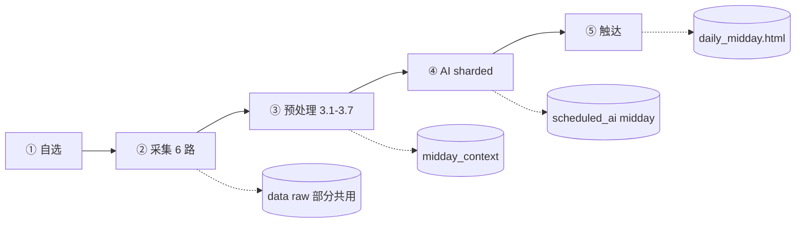

# 午间报告 · 开发方案（定稿版）

> **状态**：已实现 · 一键命令 `python run.py midday`  
> 与 **22 点晚间报告完全独立**；对照（只读）：`D:\ZXReport` · 更新：2026-06-10

## 产品一句话

交易日午间休市（约 12:50）「**午间作战卡**」：基于**上午收盘态**行情与**今晨～午间**素材，复盘上午、服务**下午午盘** → HTML 详报、微信简报、午后预期 JSON。**不采财联社 B 层五篇长文；不做 11:35 快照。**

---

## 一、定稿边界

| 项 | 定稿 |
|----|------|
| 模块关系 | `evening` / `midday` **完全独立**（命令、配置、数据、页面、微信） |
| 与晚间差异 | **仅不采财联社 B 层五篇** |
| AI | **四档 + 31 只同级 + sharded**（与晚间同量级，不砍半） |
| 产品语义 | 午间分析**上午盘**，服务**下午午盘** |
| 工程策略 | **首期复制 `packages/midday/`**，`evening` **零改动**；`report_shared` 放二期 |

### 与晚间对照

| 维度 | 22 点 evening | 午间 midday |
|------|---------------|-------------|
| 分析时点 | 收盘后 | **午间休市** |
| 行情含义 | 全日收盘 | **上午盘收盘**（index/flow `slot=midday`） |
| 服务目标 | 明日 / 次日 | **下午 13:00 起午盘** |
| 品牌名 | 明日作战卡 | **午间作战卡** |
| 财联社 A 层看盘 | 采 | **采** |
| 财联社 B 层五篇 | 采 + 3.8 digest | **不采、不 digest** |

---

## 二、架构



```
run.py midday
    └── packages/midday/          # 新建，镜像 evening 结构
            ├── collect.py        # 6 路
            ├── normalize.py      # slot=midday，不读 cls_articles
            ├── health.py         # 独立 manifest，无 B 层检查
            ├── preprocess.py     # 3.1–3.7，无 3.8
            ├── assemble.py       # 午间 global / priority
            ├── finalize.py       # midday_context
            ├── generate.py + synthesize.py + prompt_build.py
            ├── expectations.py   # 午后字段
            ├── render.py + run_full.py + run_status.py
            └── pipeline.py

packages/report/
    ├── midday_html.py            # 午间作战卡 UI
    └── midday_live.py            # 进度页

packages/ai/prompts.py            # 增补 MIDDAY_* 三套
```

**纪律**

- `midday` **禁止** `import evening`；`evening` **禁止** `import midday`。
- 首期 **不改** `packages/evening/`（二期再抽 `report_shared`）。
- `index` / `flow` 的 `--slot midday` 仅为大盘快照时段名，**不等于**报告模块耦合。

---

## 三、数据契约（独立落盘）

| 用途 | 路径 |
|------|------|
| 采集清单 | `data/collect_manifest/{date}_midday.json` |
| 上下文 | `data/midday_context/{date}.json` |
| feeds 指纹 | `data/midday_baseline/` |
| AI 结果 | `data/scheduled_ai/midday_{date}.json` |
| 运行状态 | `data/midday_run/{date}.json` |
| 预处理耗时 | `data/ai_digest/{date}/midday_manifest.json` |
| 午后预期 | `data/expectations/{date}_midday.json` |
| 报告 | `reports/{date}/daily_midday.html` |
| 最近午间 | `data/last_midday_report.json` |

**可共用 raw**（同日可刷新）：`quote_query_*`、公告、资讯、`market_sentiment`、`cls_finance`（A 层）、`market_index` / `market_flow`（内含 midday slot）。

**午间绝不写入**：`cls_articles/`、一切 `evening_*` 路径。

**JSON 顶层标识**（`midday_context`、`scheduled_ai`、`midday_run`、manifest）：

```json
{
  "slot": "midday",
  "session_label": "午间休市"
}
```

---

## 四、五步流水线

| 步 | 名称 | LLM | CLI | 主产出 |
|----|------|-----|-----|--------|
| **①** | 自选世界 | 否 | `quote query --all` | `quote_query_{date}.json` |
| **②** | 事实采集 | 否 | `collect --slot midday` | 6 路 raw + `{date}_midday.json` |
| **③** | 本地预处理 | 3.6 | `preprocess --slot midday` | `midday_context/{date}.json` |
| **④** | AI 研判 | 是（sharded） | `generate --slot midday --phase ai` | `scheduled_ai/midday_*` |
| **⑤** | 触达 | 否 | `generate --slot midday --phase render` | `daily_midday.html` + 微信 |

### ② 采集（6 模块）

| 序 | 模块 | 午间 |
|----|------|------|
| 1 | quote `--all` | 同 evening，失败**阻断** |
| 2 | announcement | 同 |
| 3 | news | 同 |
| 4 | market_sentiment | 同 |
| 5 | market_index | **`slot=midday`** |
| 6 | market_flow | **`slot=midday`** |
| 7 | cls_finance（A 层） | `include_articles=False` |
| — | ~~cls_articles（B 层）~~ | **删除** |

### ③ 预处理

| 子步 | evening | midday |
|------|---------|--------|
| 3.1–3.7 | ✓ | ✓ |
| 3.8 `run_cls_digest` | 五篇长文 LLM | **跳过** |
| `prompt.cls` | B 层摘要 | **空** 或 A 层本地短摘要（无 LLM） |

---

## 五、午间语义（防 AI 写成盘后）

### 5.1 用户可见标识

| 触点 | 午间 |
|------|------|
| 浏览器标题 / H1 | **午间作战卡** |
| 副标题 | **上午复盘 · 午后策略 · 分析时刻 …** |
| 进度页 | **生成中…午间作战卡** |
| 微信标题 | **`ZXTT 午间 · 日期`** |
| 素材 Tab | **午后预期**（非「明日预期」） |

### 5.2 时空语义对照

| 晚间用语 | 午间改法 |
|----------|----------|
| 明日作战卡 | **午间作战卡** |
| 盘后 / 22:00 | **午间休市 / 12:50** |
| 明日 / 次日 | **下午 / 午后 / 午盘** |
| 次日开盘情景 | **午后开盘情景**（13:00 附近） |
| 财联社盘后长文 | **不采**（仅 A 层看盘） |

### 5.3 AI Prompt 三层

**System（`MIDDAY_SYSTEM` / `MIDDAY_GLOBAL_SYSTEM` / `MIDDAY_SHARD_SYSTEM`）要点：**

1. 模式：午间休市；指数/资金流/现价 = **上午盘**；公告资讯 = **今晨～午间增量**。
2. 服务目标：**下午午盘（13:00 起）**，禁止以「明日开盘」「次日」为主轴。
3. 情景词表：**午后**偏强开盘 / 基准 / 偏弱开盘 / 不确定。
4. 推送：【环境】= 上午 L1 + 主线延续；【操作】= **下午总框架**。
5. 31 只同级、四档推送结构与晚间相同。

**assemble `priority_instructions` 首段：**

```text
【报告类型】午间作战卡 | 【数据】上午盘+今晨～午间素材 | 【目标】下午午盘
31 只均须正文+推送摘要各一条…
```

**global prompt 追加：**

```text
session=午间休市
data_scope=上午收盘态
serve_for=下午午盘
index_flow_slot=midday
```

`l1_brief` / `l2_brief` 前缀 **`上午盘：`**

**user prompt 固定块（global / shard / user 均加）：**

```text
## [午间分析说明]
- 当前为午间休市分析，行情与指数/资金流反映上午盘。
- 请复盘各股上午表现，并给出服务于下午午盘的研判。
- 勿按「明日盘后/次日开盘」主框架输出。
```

**个股字段（System 约束，章节名可沿用晚间）：**

| 章节 | 午间每只核心 |
|------|--------------|
| 我的·持仓深度 | 上午走势 vs 预期；下午提示 |
| 想买的·候选跟踪 | 上午走势；下午买点 |
| 观察·跌幅达预期 | 上午是否达条件；午后是否继续观察 |
| 其它·风向跟踪 | 上午异常；午后关注 |

### 5.4 expectations

- 落盘：`expectations/{date}_midday.json`（**不覆盖**晚间 `expectations/{next_td}.json`）。
- 字段：`afternoon_open_scenario` / **下午提示**（非「次日开盘情景」）。

---

## 六、P0 实现要点（审查补丁）

| # | 任务 | 原因 |
|---|------|------|
| 1 | **`midday/health.py` 独立** | 读 `{date}_midday.json`；**删除** `cls_articles_complete` 与「长文 x/5」告警 |
| 2 | **`normalize` 不加载 `cls_articles`** | 避免 trust 误报、constraints 带晚间话术 |
| 3 | **`midday/assemble` 独立 constraints** | 「午间不采 B 层」「指数/资金为上午 slot」 |
| 4 | **`synthesize` 参数化** | `run_sharded(ctx, systems=..., builders=...)`，**不复制 300 行** |
| 5 | **微信配置向后兼容** | 保留 `wechat.title_prefix`（盘后）；新增 `wechat.midday_title_prefix` |

---

## 七、配置

```yaml
wechat:
  enabled: true
  title_prefix: "ZXTT 盘后"           # 晚间不变
  midday_title_prefix: "ZXTT 午间"    # 午间独立

midday:
  synthesize_mode: sharded
  feeds_digest_workers: 8
  preprocess_cls_recollect: false       # 固定，无 B 层
```

`core/config.py` 新增 `midday_cfg()`，默认键对齐 `evening_cfg()`，去掉 B 层相关项。

---

## 八、CLI

```bash
# 一键（规划）
python run.py midday
python run.py midday --date 2026-06-10 --force
python run.py midday --no-open

# 分步
python run.py collect --slot midday
python run.py preprocess --slot midday
python run.py generate --slot midday
python run.py generate --slot midday --phase ai
python run.py generate --slot midday --phase render
```

`run.py`：`--slot midday` **只调** `midday.*`，与 `evening` 平级分支。

---

## 九、实施阶段

### 阶段 A · 数据链（约 1.5 天）

1. `midday/collect.py`（6 路 + `_midday.json`）
2. `midday/normalize.py`（`slot=midday`，无 B 层）
3. `midday/health.py`（P0）
4. `midday/preprocess.py` + `assemble` + `finalize`
5. 单测：`test_midday_collect`、`test_midday_normalize`、`test_midday_preprocess`

**里程碑**：`midday_context/{date}.json` 产出；health 无 B 层告警。

### 阶段 B · AI + 触达（约 1.5 天）

1. `MIDDAY_*` prompts
2. `prompt_build` + 参数化 `synthesize` + `generate`
3. `expectations`（午后字段）
4. `midday_html` + `midday_live` + `render`
5. `run_full` + `run_status` + `run.py midday`
6. 单测：`test_midday_generate`、`test_midday_render`、`test_midday_live`

**里程碑**：`daily_midday.html` + 微信「ZXTT 午间」。

### 阶段 C · 文档（约 0.5 天）

- 本文件（开发主文档）
- `packaged-modules.md` §10
- `README.md` 午间命令一行

### 阶段 D · 二期（可选）

- `report_shared` 抽离（evening + midday 同改）
- 同日 feeds digest 跨时段复用
- 午间 hero 配色区分

**总工期：约 3.5 天**

---

## 十、测试与验收

```bash
python -m unittest tests.test_midday_collect tests.test_midday_preprocess \
  tests.test_midday_generate tests.test_midday_render -v
python run.py midday --date 2026-06-10 --force
```

| # | 验收项 |
|---|--------|
| 1 | 全流程 OK，`daily_midday.html` 标题为 **午间作战卡** |
| 2 | 无 `cls_articles` 采集与 digest |
| 3 | health / constraints **无**「财联社长文 x/5」 |
| 4 | index / flow 为 **midday** slot |
| 5 | `scheduled_ai/midday_{date}.json` 且 `slot=midday` |
| 6 | 微信 **ZXTT 午间**；晚间推送不变 |
| 7 | 同日复跑 evening + midday，互不写对方目录 |
| 8 | AI【操作】指向 **下午**，非「明日开盘」主轴 |

---

## 十一、风险与缓解

| 风险 | 缓解 |
|------|------|
| health 误报 B 层不齐 | 午间独立 health + normalize 不读 B 层 |
| manifest 路径混用 | 专用 `{date}_midday.json` |
| synthesize 双份漂移 | 参数化合成 |
| wechat 破坏晚间 | `midday_title_prefix` 增量键 + fallback |
| AI 仍写「明日」 | System + `[午间分析说明]` + 单测抽检 |

---

## 十二、相关文档

- 晚间对照：[`evening-dev.md`](evening-dev.md)
- 打包模块（§10 待补）：[`packaged-modules.md`](packaged-modules.md)
