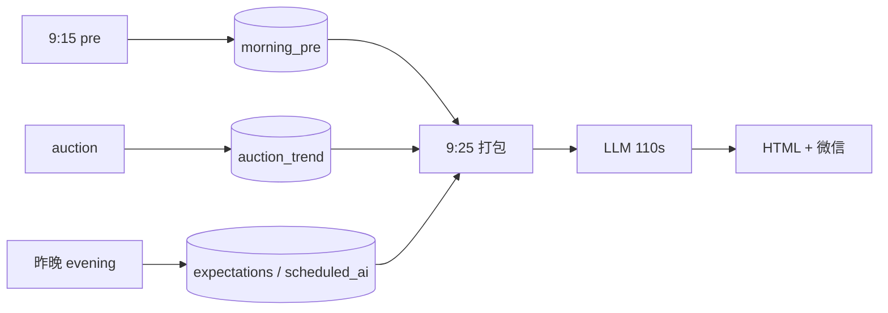

# 早盘集合竞价报告 · 开发方案（定稿版）

> **状态**：已实现 · `python run.py morning --phase pre`（9:15）/ `python run.py morning`（报告档）  
> 与 **evening**、**midday** **完全独立**；对照（只读）：`D:\ZXReport` · 更新：2026-06-10

## 产品一句话

交易日 **9:25 左右「开盘核对卡」**：在 **昨晚作战卡 + 今 9:15 隔夜素材 + 集合竞价完整走势** 基础上，由 AI 给出 **9:30 起前 30 分钟**开盘指导 → HTML 详报、微信简报。**不采财联社 B 层；不立新「明日预期」。**

---

## 一、定稿边界

| 项 | 定稿 |
|----|------|
| 模块关系 | `evening` / `midday` / `morning` **完全独立**（命令、配置、数据、页面、微信） |
| 与 `auction` | `auction` **只采集**；`morning` **只读** `auction_trend`，不 import `auction` 采集逻辑 |
| 两档时刻 | **9:15** 采集（无 HTML）；**≈9:25:10** 出报告 |
| AI | **单次合成**（非 sharded）；`timeout` **110s** |
| SLA | 竞价就绪后 **120s 内** 微信送达；**无模板降级**（AI 失败则报告档 `outcome=error`，见 §三） |
| 素材 | 9:15 **31 只全采**公告+资讯；无新须明示 |
| 逐只篇幅 | **我的、想买的**短评；其余 **一句**；**表现突出**可升格短评 |
| 工程策略 | **轻量 3 步**（pre → 拼装核对 → AI+触达）；**不镜像** midday 五步 |

### 与晚间 / 午间对照

| 维度 | evening 22:00 | morning ≈9:25 | midday 12:50 |
|------|---------------|---------------|--------------|
| 角色 | 立明日预期 | **核对预期 + 竞价 + 隔夜增量** | 上午复盘 |
| 竞价 | 不采 | **读 `auction_trend`** | 不采 |
| 财联社 B 层 | 采 + digest | **不采** | 不采 |
| 新预期 JSON | `expectations/{次日}` | **不产** | `expectations_{date}_midday` |
| AI 模式 | sharded 31 | **单次合成** | sharded 31 |
| 品牌名 | 明日作战卡 | **开盘核对卡** | 午间作战卡 |

---

## 二、时刻表与计划任务

| 时刻 | 进程 | 命令 | 产出 |
|------|------|------|------|
| **9:15:05** | A（并行） | `python run.py auction` | `auction_trend`（末点约 **9:25:10**） |
| **9:15:05** | B（并行） | `python run.py morning --phase pre` | `morning_pre/{date}.json` |
| **9:25:12** | C | `python run.py morning` | 报告 + 微信 |

```
09:15:05  scripts/run_auction_watch.bat
09:15:05  scripts/run_morning_pre.bat
09:25:12  scripts/run_morning_report.bat
```

**说明**

- 公告/资讯比对窗口 **9:15～9:25**，**不计入** 120s SLA。
- 竞价默认 `watch_end=09:25:05`；末点写入常晚数秒，以 `last_auction_watch.outcome=ok` 且 `point_count≥2` 为准。
- `morning` 报告档可内建 `wait_auction_ok`（`wait_auction_max_sec`，默认 15），与 9:25:12 计划任务二选一即可。
- **9:25 报告档禁止**：再采公告/资讯、`quote query --all`、财联社、flow/ecosystem 全量。

---

## 三、SLA（硬约束）

| 项 | 值 |
|----|-----|
| 起点 | `auction_trend` 就绪（`last_auction_watch.outcome=ok`） |
| 终点 | 微信 PushPlus **成功** + `daily_morning.html` 落盘 |
| 总时限 | **120s** |
| LLM | **`llm_timeout_sec: 110`**，单次 `chat()`，**不重试** |
| 非 AI | 拼装、核对、渲染、推送 **≤10s**（只读 JSON；`collect_open_market_context` 与等待竞价并行） |

**无降级**：AI 超时/失败时 **不**改发模板句；`morning_run` 记 `sla_ok=false`，HTML 可仅含核对表（无 AI 段）或整档失败，由 `on_ai_fail` 配置（默认 `error`）。

`morning_run/{date}.json` 字段：`auction_ready_at`、`ai_duration_ms`、`delivered_at`、`sla_ms`、`sla_ok`。

```yaml
morning:
  sla_sec: 120
  llm_timeout_sec: 110
  wait_auction_max_sec: 15
  llm_max_tokens: 4000
  on_ai_fail: error   # error | partial_html
```

`config.example.yaml` 实现时增补 `morning` 段与 `wechat.morning_title_prefix`。

---

## 四、架构



```
run.py morning --phase pre
run.py morning
    └── packages/morning/
            ├── pre_collect.py
            ├── assemble.py
            ├── checks.py
            ├── prompt_build.py
            ├── synthesize.py
            ├── render.py
            ├── run_status.py
            └── pipeline.py

packages/report/morning_html.py
packages/report/morning_live.py
packages/ai/prompts.py          # MORNING_*
```

**纪律**

- `morning` **禁止** `import evening`、`import midday` 包内编排模块。
- 指纹/合并逻辑：在 `morning/` 内 **复制** `feeds_fingerprint` 最小子集，或依赖 `announcement`/`news` query + 本地 `merge_feeds`（与 `evening/normalize._merge_feeds` 同构），**不**调用 `evening.preprocess`。
- `collect_open_market_context()` 在 `market.sentiment`，**不在** `auction` 模块内。

---

## 五、数据契约

| 用途 | 路径 |
|------|------|
| 9:15 采集 | `data/morning_pre/{date}.json` |
| 核对结果 | `data/morning_checks/{date}.json` |
| AI 输入 | `data/morning_context/{date}.json` |
| AI 输出 | `data/scheduled_ai/morning_{date}.json` |
| 运行进度 | `data/morning_run/{date}.json` |
| 报告 | `reports/{date}/daily_morning.html` |
| 最近早盘 | `data/last_morning_report.json` |

**只读依赖**

| 路径 | 用途 |
|------|------|
| `data/auction_trend_{date}.json` | 竞价主产出 |
| `data/last_auction_watch.json` | 竞价是否完成 |
| `data/expectations/{今日交易日}.json` | 昨晚立的今日预期 |
| `data/scheduled_ai/evening_{昨交易日}.json` | 昨晚 AI（预期回退） |
| `data/evening_baseline/{昨交易日}.json` | 9:15 指纹对比（晚间 ③ 写入） |
| `data/quote_query_{date}.json` | join 我的/想买的 |

**交易日历**

| 读什么 | 路径 |
|--------|------|
| 今日预期 | `expectations/{今日}.json` |
| 昨晚 AI | `scheduled_ai/evening_{previous_trading_day(今日)}.json` |
| 指纹基准 | `evening_baseline/{previous_trading_day(今日)}.json` |

JSON 顶层：

```json
{ "slot": "morning", "phase": "pre | report", "session_label": "集合竞价结束" }
```

**不写**：`evening_baseline`（9:15 只读）、`cls_articles`、一切 `evening_*` / `midday_*` 路径。

---

## 六、三步流水线

| 步 | 名称 | 时刻 | LLM | CLI | 主产出 |
|----|------|------|-----|-----|--------|
| **A** | 9:15 采集 | 9:15 | 仅 `refresh` 股 digest | `morning --phase pre` | `morning_pre` |
| **B** | 拼装+核对 | 9:25+ | 否 | （报告内） | `morning_checks`、`morning_context` |
| **C** | AI+触达 | 9:25+ | **110s** | `morning` | `scheduled_ai/morning_*`、HTML、微信 |

`auction` 与步 A **并行**，不属于 `morning` 包内步骤。

---

## 七、步 A · 9:15 采集（`--phase pre`）

### 7.1 代码列表（31 只）

优先级：

1. `quote_query_{今日}.json` 的 `quotes` code 去重  
2. 若无 → `quote_query_{previous_trading_day(今日)}.json`  
3. 仍无 → `watchlist` 拉自选（与 `quote query --all` 同源）

**不在 9:15 跑** `quote query --all`（避免占满 10 分钟窗口）；运维可在开盘前手动刷新。

### 7.2 公告 + 资讯

- 调用 `query_announcements` + `query_news`（与 midday ② 同源），按 code 合并为 `feeds_merged`（五栏：公告、研报、资讯、观点、行业资讯）。
- 指纹对比：`evening_baseline/{previous_trading_day(今日)}`（语义：昨晚 22:00 盘后态）。

### 7.3 三态（每只必有，禁止空白）

| 状态 | 条件 | 展示文案 |
|------|------|----------|
| `refresh` | 指纹相对昨晚 baseline 变化 | 有新增 |
| `reuse` | 指纹与昨晚一致 | 与昨晚盘后一致，沿用 |
| `no_new` | 采成功且五栏条目全 0（`decide_feeds_status` 的 `empty`） | 自昨晚 22:00 后无新公告/资讯 |
| `failed` | 采集失败 | 采集失败 |

### 7.4 digest

仅 `refresh` 的 code 跑轻量 digest；**禁止** 31 只全跑。

### 7.5 `morning_pre/{date}.json` 骨架

```json
{
  "slot": "morning",
  "phase": "pre",
  "calendar_date": "2026-06-11",
  "finished_at": "...",
  "code_count": 31,
  "by_code": {
    "600519": {
      "status": "reuse",
      "fingerprint": "...",
      "item_counts": { "公告": 0, "资讯": 2, ... },
      "digest": null
    }
  },
  "summary": { "refresh": 2, "reuse": 28, "no_new": 1, "failed": 0 }
}
```

---

## 八、竞价产出（只读）

**主读** `data/auction_trend_{date}.json`：

| 字段 | 含义 |
|------|------|
| `point_count` | 采样点数（完整约 21；`--force` 为 1） |
| `stocks[].end_gap` | 终缺口% |
| `stocks[].shape` | 全程形态 |
| `stocks[].shape_after_920` | **9:20 后形态（优先）** |
| `stocks[].gap_path`、`amount_delta_*` | 缺口曲线、竞价放量 |
| `stocks[].limit_status` | 末点涨跌停 |

**不含**：大盘指数、情绪、公告资讯。`group` 在仅 config `codes` 时常为空。

**分组**：`checks.py` join `quote_query.memberships` → `holding`（我的）/ `candidate`（想买的）/ 其它。  
`config.yaml` 中 `auction.tier_groups` 仅影响自选去重，**不**写入 `auction_trend`。

形态枚举：数据不足、震荡、一路抬升、一路走弱、尾盘上翘、尾盘下压、冲高回落、探底回升、偏强上行、偏弱下行。

---

## 九、步 B · 拼装与核对

### 9.1 打包给 AI（一次提交）

| # | 来源 | 内容 |
|---|------|------|
| ① | `evening_{昨}` + `expectations/{今}` | 昨晚结论与开盘预期 |
| ② | `morning_pre/{今}` | 9:15 三态 + 增量 digest |
| ③ | `auction_trend/{今}` | 完整竞价走势 |
| ④ | `morning_checks` | verdict、highlight、核对表 |
| ⑤ | `collect_open_market_context()` | 昨涨停溢价 + 指数开盘缺口 + 昨晚情绪缓存（可选，几秒） |

**输入纪律**：推送摘要级昨晚结论 + 核对表 + 每股竞价 **一行**；**禁止**塞入 `evening` 全文。

### 9.2 昨晚预期（双轨）

1. `expectations/{今日}.stocks[code]`：`expected_open`、`discipline`、`check_925`
2. 若 `expected_open` 为空 → 从 `scheduled_ai/evening_{昨}.body` **规则抽取**开盘情景（偏高开 / 偏低开 / 不确定 / 震荡/中性 / 略偏强 / 略偏弱）

### 9.3 本地 `verdict`

超预期偏强 / 超预期偏弱 / 符合 / 部分符合 / 不符合 / 数据缺失（对齐 ZXReport `_match_verdict`）。AI **引用** verdict。

### 9.4 `highlight`

任一满足：

- `verdict` ∈ {超预期偏强, 超预期偏弱, 不符合}
- `|end_gap| ≥ 2%` 或 `limit_status ≠ 正常`
- `shape_after_920` ∈ {一路抬升, 一路走弱, 冲高回落, 探底回升}
- 9:15 `status=refresh` 且标题命中晚间同级 **轻量规则**（MVP 可仅标「有新增素材」，二期接 3.3 规则）

---

## 十、步 C · AI 与触达

### 10.1 合成

- **单次** monolithic；`timeout_sec=110`；`max_tokens≤4000`；**不重试**
- **禁止** midday sharded

### 10.2 篇幅（Prompt 硬约束）

| 层级 | 范围 | 篇幅 |
|------|------|------|
| tier0 | 我的 + 想买的 | 短评 2–4 句 |
| tier1 | 其余 | **一句** |
| tier1* | 其余且 `highlight` | 升格短评 |
| 全局 | 【环境】【9:15素材】【操作】 | 各 1–2 句 |

### 10.3 System（`MORNING_SYSTEM`）

1. 集合竞价 vs 昨晚预期；服务 **9:30 后前 30 分钟**。
2. 不重写基本面；无新证据不推翻昨晚。
3. 无新素材须写「自昨晚 22:00 后无新公告/资讯」。
4. 推送：【环境】【9:15素材】【超预期】【我的】【想买的】【操作】。

### 10.4 触达

| 项 | 约定 |
|----|------|
| HTML | `reports/{date}/daily_morning.html` |
| 微信 | `slot="morning"`；`wechat.morning_title_prefix` 默认 **`ZXTT 开盘`** |
| 进度 | `morning_live`（pre + report） |

### 10.5 页面（4 块）

1. 全局  
2. **9:15 素材**（三态）  
3. **核对主表**  
4. 折叠昨晚推送摘要  

---

## 十一、前置检查

| 条件 | 结果 |
|------|------|
| 非交易日 | `skip` |
| `last_auction_watch` 非 ok 或 `point_count<2` | **error**，提示先跑 `auction` |
| 缺 `expectations/{今}` 且无 `evening_{昨}` | **error** |
| 缺 `morning_pre/{今}` | **error**，提示 `--phase pre` |
| 缺 `quote_query`（今或昨交易日） | **error**，提示运维预跑 `quote query --all` |

---

## 十二、P0 实现清单

| # | 任务 |
|---|------|
| 1 | `packages/morning/` + `run.py` 子命令 |
| 2 | `pre_collect.py` |
| 3 | `checks.py`（双轨预期 + join group） |
| 4 | `assemble` + `prompt_build` |
| 5 | `synthesize.py`（110s） |
| 6 | `morning_html` + 微信 `morning_title_prefix` |
| 7 | `morning_live` + SLA 字段 |
| 8 | 三个 bat |
| 9 | `tests/test_morning.py` |

---

## 十三、验收

```bash
python run.py auction --simulate --date 2026-06-10
python run.py morning --phase pre --force --date 2026-06-10
python run.py morning --force --date 2026-06-10
```

| 检查项 | 预期 |
|--------|------|
| `morning_run.sla_ok` | `true`（生产）；`ai_duration_ms ≤ 110000` |
| 微信 | 「ZXTT 开盘 · 日期」 |
| HTML | 核对表 31 只；9:15 三态无空白 |
| 全无新素材 | 明示「昨晚 22:00 后无新公告/资讯」 |
| `auction --force` 单点 | `shape=数据不足` 可出报告并标注 |

---

## 十四、关联文档

- 竞价采集：[`packaged-modules.md` §4](packaged-modules.md)  
- 晚间：[`evening-dev.md`](evening-dev.md)  
- 午间：[`midday-dev.md`](midday-dev.md)
